# 第一章 概论


## 1.1数据结构的基本概念

> 概念理解而已

数据：数据是信息的载体，是描述客观事物属性的数、字符及所有能输入到计算机中并被计算机程序识别和处理的符号的集合。数据是计算机程序加工的原料。

数据元素：**数据元素是数据的基本单位**，通常作为一个整体进行考虑和处理。**一个数据元素可由若干数据项组成，数据项是构成数据元素的不可分割的最小单位。**例如，学生记录就是一个数据元素,它由学号、姓名、性别等数据项组成。

数据对象：**数据对象是具有相同性质的数据元素的集合**，是数据的-一个子集。例如，整数数据对象是集合N= {0, -1, +2}。

数据类型：数据类型是一个**值的集合和定义在此集合上的一组操作**的总称。
1)原子类型。其值不可再分的数据类型。
2)结构类型。其值可以再分解为若干成分(分量)的数据类型。
3)抽象数据类型。抽象数据组织及与之相关的操作。

数据结构：**数据结构是相互之间存在一种或多种特定关系的数据元素的集合**。在任何问题中，数据元素都不是孤立存在的，它们之间存在某种关系，这种数据元素相互之间的关系称为结构(Structure)。**数据结构包括三方面的内容:逻辑结构、存储结构和数据的运算**。数据的逻辑结构和存储结构是密不可分的两个方面，一个算法的设计取决 于所选定的逻辑结构，而算法的实现依赖于所采用的存储结构”。

### 数据结构的三要素

#### 数据的逻辑结构

数据元素之间的逻辑关系，从逻辑关系上描述数据。与数据的存储无关，独立于计算机。分为线性结构（线性表）和非线性结构（集合、树和图等）。
数据的逻辑机构的如图所示：


集合。结构中的数据元素之间除“同属一个集合”外，别无其他关系，如图1.2(a)所示。
线性结构。结构中的数据元素之间只存在一对一的关系，如图1.2(b)所示。
树形结构。结构中的数据元素之间存在一对多 的关系，如图1.2(c)所示。
图状结构或网状结构。结构中的数据元素之间存在多对多的关系，如图1.2(d)所示。


#### 数据的存储结构

存储结构是指数据结构在计算机中的映像，也叫做物理结构。包括数据元素的表示和关系表示。存储结构不同，运算实现的方式也不同

* 顺序存储：顺序存储。把逻辑上相邻的元素存储在物理位置上也相邻的存储单元中元素之间的关系由存储单元的邻接关系来体现。其优点是可以实现随机存取，每个元素占用最少的存储空间;缺点是只能使用相邻的一整块存储单元，因此可能产生较多的外部碎片。
* 链式存储：不要求逻辑上相邻的元素在物理存储上也相邻，通过指针表示元素之间的逻辑关系。优点就是不会出现碎片现象，能够充分利用所有存储单元；缺点就是每个元素因为存储指针而需要占用额外的存储空间，**且只能顺序存储**。
* 索引存储：在存储元素信息的同时,还建立附加的索引表。索引表中的每项称为索引项，**索引项的一般形式是(关键字,地址)**。其优点是检索速度快;缺点是附加的索引表额外占用存储空间。另外，增加和删除数据时也要修改索引表，因而会花费较多的时间。
* 散列存储：根据元素的关键字直接计算出该元素的存储地址，又称哈希(Hash) 存储。其优点是**检索、增加和删除结点的操作都很快**;缺点是若散列函数不好，则可能出现元素存储单元的冲突，而解决冲突会增加时间和空间开销。

#### 数据的运算

数据结构有哪些基本操作？

### 本节例题


链式存储设计，各个节点存储空间可以不连续，但是**节点内**的存储单元地址必须连续！。节点内部有值域和指向下一个节点的指针，这两个数据的存储单元是连续的。


## 1.2 算法和算法评价

算法是对特定问题求解步骤的一种描述，指指令的有限序列，其中每一条指令表示一个或者多个操作。有5个特性：

* 有穷性：一个算法必须在有穷的步骤完成并且在有穷的时间内完成，一个步骤必须在有穷的时间内完成。
* 确定性：算法中每一条指令必须有确切的含义，对于相同的输入只能有相同的输出。
* 可行性：算法的操作都可以通过已经实现的基本运算执行有限次数来实现。
* 输入：零个或者多个输入，输入取自某个特点的集合
* 输出：一个或者多个输出，输出是与输入有特定关系的两。

算法需要达到的目标：

* 正确性：算法可以正确的求解问题
* 可读性：算法应该具有良好的可读性
* 健壮性：对于非法输入数据，算法能够适当地做出反应和进行处理，而不会产生奇怪的结果。
* 高效率与低存储需求：效率指的是算法的时间复杂度，存储量就是算法所需要的最大空间需求。

### 算法效率的度量

### 分治算法的时间复杂度的计算

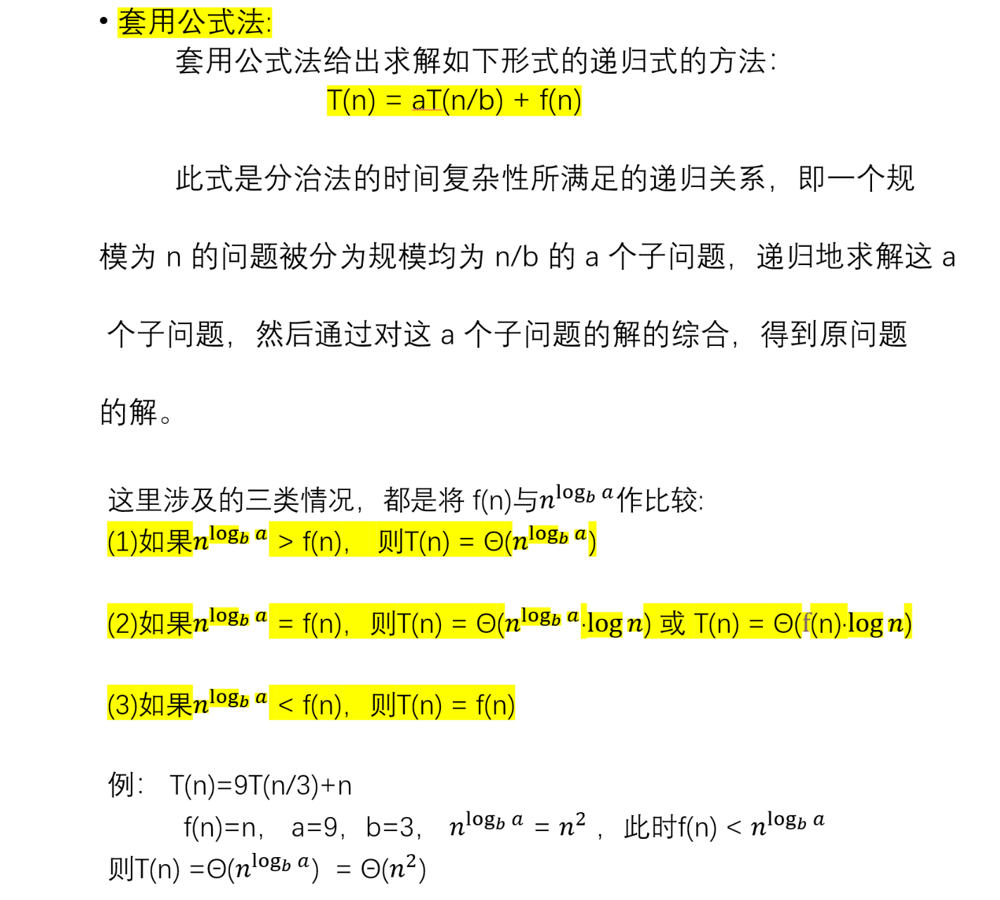


#### 时间复杂度<:star:>

最坏时间复杂度：最坏情况下算法的时间复杂度

平均时间复杂度：所有可能输入实例在等概率出现的情况下，算法的期望运行时间

最好时间复杂度：最好情况下算法的时间复杂度

一般都是考虑最坏时间复杂度，这样可以保证算法的运行时间不会比这个更长。

加法规则：
$$
T(n)=T_1(n)+T_2(n)=O(f(n))+O(g(n))=O(max(f(n), g(n)))
$$
乘法规则：
$$
T(n)=T_1(n)\times T_2(n)=O(f(n))\times O(g(n))=O(max(f(n)\times g(n)))
$$
常见的渐进时间复杂度为：
$$
O(1) < O(log_2n) <O(n)<O(nlog_2n)<O(n^2)<O(n^3)<O(2^n)<O(n!)<O(n^n)
$$

#### 空间复杂度

一个程序在执行时除需要存储空间来存放本身所用的指令、常数、变量和输入数据外，还需要一些对数据进行操作的工作单元和存储-一些为实现计算所需信息的辅助空间。若输入数据所占空间只取决于问题本身，和算法无关，则只需分析除输入和程序之外的额外空间。

#### 本节例题


算法就是对问题求解的步骤，我错选了C，C只是算法的特性，但不是算法的定义。


两个有序的列表合并成一个新的列表，利用两个指针从两个列表指，合并成一个降序链表，那么两个指针谁小就把那个头插到待合并的链表里，直到其中一个链表全部合并到新的链表里。这样再将长的那个直接加入到待合并的链表中。所以需要`max(m, n)`


这里sum += i++ 等价于 i++; sum += i;最后的式子就变成了这样：1 + 2 + 3 + …… + i = (i + 1)i / 2;i循环的次数只需要达到O(x^1/2^)


这道题目就不应该呀，很明白的，认真分析一下：每次都是1^2^,2^2^,3^2^,……,x^2^;所以x最大可以执行到O(n^1/2^)


这道题就需要分析一下：外层循环到i，里层就执行i，因此假设外层循环到k，那么循环一共执行了1 + 2 + 2^2^ + 2 ^3^ + …… + 2^k-1^= 2 ^k^- 1.外层的k最大可以达到log~2~n，那么一共就可以执行n - 1次。时间复杂度就是O(n)


这道题目也是需要具体分析一下的，**记住，事件复杂度就是去算操作次数！**

设n = 2 ^k^; 那么 T(2 ^k^) = 2 T(2 ^k-1^) + 2 ^k^= 2^2^T(2 ^k-2^ ) + 2 * 2 ^k^ = 2^3^ T(2 ^k-3^) + 3 * 2 ^k^ = 2^k^ + k * 2 ^k^ = 2 ^k^ (k + 1)

k = log~2~n  所以最后的操作数为：n（log~2~n   + 1） 时间复杂度为O(nlog~2~n)

## 本章总结

### 对于递归程序如何求时间复杂度？

使用公式进行一步一步的递推

例题：

这是一个求n！的算法，n！=n(n - 1)(n - 2)……1，每一次递归传入的参数都-1，那么只需要递归n次，其实也就是循环n次。所以时间复杂度为O(n).

# 第二章 线性表

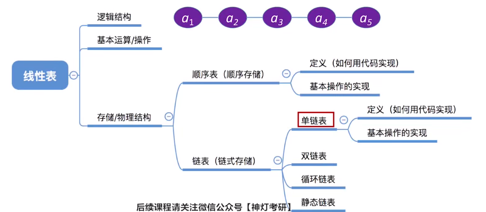

**考纲内容**

* 线性表的基本概念
* 线性表的实现：
  * 顺序存储
  * 链式存储
* 线性表的应用

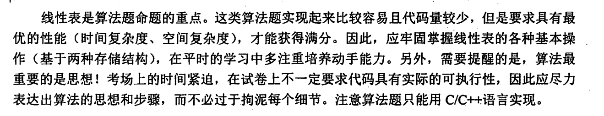

## 2.1线性表定义和基本操作

线性表是具有==**相同数据类型**==的n（n≥0）个**==数据元素的====有限序列==**.除了开始元素外，每一个元素都只有唯一的前驱元素。

顺序表优点：可以随机存储，存储密度高；缺点：要求大片的连续空间，改变容量不方便。

要点：

* 相同数据类型
* 有限序列
* 元素具有逻辑上的顺序性

线性表有以下特点：

* 表中元素**个数有限**；
* 表中元素**具有逻辑上的顺序性**，表中元素有其先后顺序；
* 表中每一个元素都是数据元素，每一个元素都是单个元素；
* 表中**数据类型都相同**，每个元素占有相同的存储空间；
* 表中的元素具有抽象性，仅讨论元素之间的逻辑关系，而不需要主要元素内容。

**线性表是一种逻辑结构，表示元素之间一对一的逻辑关系。顺序表和链表是两种存储方式！**

线性表的基本操作：

* `InitList (&L)`:初始化表。构造一个空的线性表。
* `Length(L)`:求表长。返回线性表L的长度，即L中数据元素的个数。
* `LocateElem(L,e)`:按值查找操作。在表L中查找具有给定关键字值的元素。
* `GetE1em(L,i)`:按位查找操作。获取表L中第i个位置的元素的值。
* `ListInsert(&L,i,e)`:插入操作。在表L中的第i个位置上插入指定元素e。
* `ListDelete (&L, i,&e)`:删除操作。删除表L中第i个位置的元素,并用e返回删除元素的值。
* `PrintList (L)`:输出操作。按前后顺序输出线性表L的所有元素值。
* `Empty(L)`:判空操作。若L为空表，则返回true,否则返回false。
* `DestroyList(&L)`:销毁操作。销毁线性表，并释放线性表L所占用的内存空间。

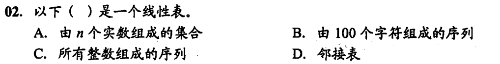

A：集合不一定是逻辑上有序的。所以A错误；C所有整数的个数是无穷的；D邻接表是一种存储结构。

## 2.2线性表的顺序表示< :bangbang: :star: >

**顺序表：线性表的顺序存储**；使用一组地址连续的存储单元依次存储线性表中的元素，从而使得逻辑上相邻的数据元素在物理存储位置上也相邻。

**顺序表的特点就是逻辑顺序与物理顺序相同。**

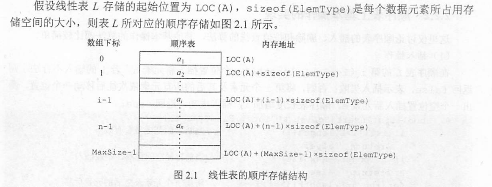

每个数据元素的存储位置都和线性表的起始位置相差一个和该数据元素的位序成正比的常数（`sizeof(ElemType)`），因此，顺序表中的任意一个数据元素都可以随机存取，所以线性表的顺序存储结构是一种随机存取的存储结构。通常用高级程序设计语言中的数组来描述线性表的顺序存储结构。

**线性表的元素的位序是从1开始的，数组中的元素的下表是从0开始的。**

这里假设元素的数据类型是`ElemType`.那么线性表的顺序存储类型就如下图所示：

```c++
# define MaxSize 50
typedef struct{
    ElemType data[MaxSize];
    int length;
}SqList;	// 顺序表的类型定义
```

一维数组可以是**静态分配**的，也可以是**动态分配**的。

在静态分配时，由于**数组的大小和空间事先已经固定**，一旦空间占满， 再加入新的数据就会产生溢出，进而导致程序崩溃。
而在动态分配时，存储数组的空间是在**程序执行过程中通过动态存储分配语句分配**的，一旦数据空间占满，就另外开辟一块更大的存储空间，用以替换原来的存储空间，从而达到扩充存储数组空间的目的，而**不需要为线性表一次性地划分所有空间**。

```c++
/*
* 动态分配顺序表的类型定义
*/
# define InitSize 100 //表长度的初始定义
typedef struct{
    ElemType *data;		// 动态分配数组的指针
    int MaxSize, length;	// 数组的最大容量和当前的个数
}SeqList;	// 动态分配数组顺序表的类型定义
```

C语言的初始动态分配语句：

```c
L.data = (ElemType*)malloc(sizeof(ElemType) * InitSize);
```

C++的初始动态分配语句：

```c++
L.data = new ElemType[InitSize];
```

* 顺序表的最主要的特点就是可以**随机访问**，可以通过首地址和元素序号可以在时间复杂度O(1)内找到指定的元素。（**查找元素的时间复杂度是O(1)**）
* 顺序表的存储密度高，每一个节点只存储数据元素。
* 顺序表的逻辑上相邻的元素在物理存储上也相邻，所以插入和删除元素需要移动大量的元素（时间复杂度高）

### 顺序表的基本操作的实现

#### 插入操作

注意线性表中元素的位序是从1开始的，数组是从0开始的。

插入函数的功能：在顺序表L中的第i（1 ≤ i ≤ L.length + 1）个位置插入新的元素e。（如果i = 1 ，就是在顺序表的头部插入，i = L.length + 1 就是在尾部插入元素）

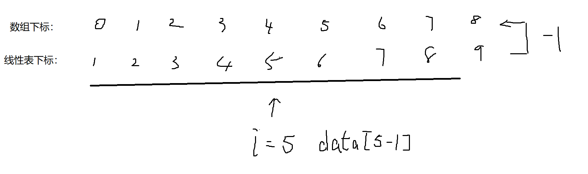

```c
# define MaxSize 50
typedef struct{
    ElemType data[MaxSize];
    int length;
}SqList;	// 顺序表的类型定义

bool ListInsert(SqList &L, int i, ElemType e)
{
    // 判断i的范围是否有效
    if(i < 1 || i > L.length + 1) return false;
    // 判断当前存储空间是否已满
    if(L.length >= MaxSize) return false;
    // 在第i个位置插入，那么原来的第i个位置以及之后的元素都需要后移一位
    for(int j = L.length; j >= i; j--)
        L.data[j] = L.data[j - 1];
    L.data[i - 1] = e; // 在第i个位置放入e
    L.length++;
    return true;
}
```

时间复杂度分析：

> 时间复杂度分析要抓最里层的语句执行的次数

最好的情况当然就是在尾部插入，这样不需要移动元素，最里层的`L.data[j] = L.data[j - 1];`执行次数为0

最坏的情况当前是在头部插入一个元素，这样需要移动n个元素，最里层的`L.data[j] = L.data[j - 1];`执行次数为n

平均来看，假如说每次插入的位置出现的概率是相等的，概率p = $$\frac {1}{n +1}$$.
i = 1，循环n次；i = 2；循环n - 1次；……i = n，循环0次。

最后执行的平均次数为：
$$
n \times p + (n - 1) \times p + …… + 0 \times p = \frac{n(1 + n)}{2} \times \frac{1}{n + 1}=\frac {n}{2}
$$
所以最后的时间复杂度为O(n)，*其实看最坏的时间复杂度不就行了~:smile:*

#### 删除操作

删除顺序表L中第i（1≤ i ≤ L.length）个位置的元素，将这个元素记住引用变量e返回，并且将第i+1个元素后面的元素都往前移一位。当然，顺序表的长度要-1。

```c++
[[include]] <stdio.h>
[[define]] MaxSize 10

typedef struct{
    int data[MaxSize];
    int length;
}SqList;
void InitList(SqList &L)
{
    L.length = 0;
}
// 插入
bool ListInsert(SqList &L, int i, int e)
{
    if(i < 1 || i > MaxSize) return false;
    if(L.length > MaxSize) return false;
    for(int j = L.length; j >= i; j--)
        L.data[j] = L.data[j - 1];
    L.data[i - 1] = e;
    L.length++;
    return true;
}
// 删除
bool ListDelete(SqList &L, int i, int &e)
{
    if(i < 1 || i > MaxSize) return false;
    e = L.data[i - 1];
    for(int j = i; j < L.length; j++)
        L.data[j - 1] = L.data[j];
    L.length--;
    return true;
}
int main()
{
    SqList L;
    InitList(L);
    for(int i = 1; i <= 10; i++)
    {
        ListInsert(L, i, i);
    }
    int e = -1;
    printf("删除前元素：");
    for(int i = 0; i < L.length; i ++)
        printf("%d ", L.data[i]);
    ListDelete(L, 5, e);
    printf("\n本次删除了元素: %d \n", e);
    printf("删除后元素：");
    for(int i = 0; i < L.length; i ++)
        printf("%d ", L.data[i]);
    return 0;
}


/*
删除前元素：1 2 3 4 5 6 7 8 9 10 
本次删除了元素: 5 
删除后元素：1 2 3 4 6 7 8 9 10 
*/
```

最好情况当然是只在尾部删除元素，这样只需要移动0次。

最坏的情况当然在头部删除元素，这样就需要移动n-1次。

下面我们计算平均的情况：在第1个位置移动n-1次，第二个位置移动n-2次，……，第n个位置移动0次。每一个位置的概率可能是p = $$\frac{1}{n}$$

所以平均下来的移动次数为：
$$
\frac{1}{n}[(n-1)+(n-2)+···+1] = \frac{1}{n}\times\frac{n\times (n-1)}{2}=\frac{n-1}{2}
$$
因此顺序表的时间删除操作的平均时间复杂度为O(n)

**由此可见，顺序表中的插入和删除操作的主要的时间消耗在顺序表中的元素移动上。**

#### 按值查找

在顺序表L中查找第一个元素等于e的元素，并且返回其在顺序表中的位置。

```c++
[[include]] <stdio.h>
[[define]] MaxSize 10

typedef struct{
    int data[MaxSize];
    int length;
}SqList;
void InitList(SqList &L)
{
    L.length = 0;
}
// 插入
bool ListInsert(SqList &L, int i, int e)
{
    if(i < 1 || i > MaxSize) return false;
    if(L.length > MaxSize) return false;
    for(int j = L.length; j >= i; j--)
        L.data[j] = L.data[j - 1];
    L.data[i - 1] = e;
    L.length++;
    return true;
}
// 删除
bool ListDelete(SqList &L, int i, int &e)
{
    if(i < 1 || i > MaxSize) return false;
    e = L.data[i - 1];
    for(int j = i; j < L.length; j++)
        L.data[j - 1] = L.data[j];
    L.length--;
    return true;
}
// 按值查找
int LocateElem(SqList &L, int v)
{
    for(int i = 0; i < L.length; i++)
        if(L.data[i] == v) return i + 1;
    return 0;
}
int main()
{
    SqList L;
    InitList(L);
    for(int i = 1; i <= 10; i++)
    {
        ListInsert(L, i, i);
    }
    int e = -1;
    printf("删除前元素：");
    for(int i = 0; i < L.length; i ++)
        printf("%d ", L.data[i]);
    ListDelete(L, 5, e);
    printf("\n本次删除了元素: %d \n", e);
    printf("删除后元素：");
    for(int i = 0; i < L.length; i ++)
        printf("%d ", L.data[i]);
    int v;
    scanf("%d", &v);
    printf("\n本次查询的元素是: %d\n", v);
    int res = LocateElem(L, v);
    if(res) printf("其在顺序表中的位置: %d", res);
    else printf("未找到该元素");
    return 0;
}

/*
3

删除前元素：1 2 3 4 5 6 7 8 9 10 
本次删除了元素: 5 
删除后元素：1 2 3 4 6 7 8 9 10 
本次查询的元素是: 3
其在顺序表中的位置: 3

5

删除前元素：1 2 3 4 5 6 7 8 9 10 
本次删除了元素: 5 
删除后元素：1 2 3 4 6 7 8 9 10 
本次查询的元素是: 5
未找到该元素
*/
```

最好情况就是在第一个位置就可以找到元素；最坏的情况是在最后一个位置找到元素；

我们算法一下平均情况下的时间复杂度：
$$
\frac{1}{n} \times (1+2+3+···+n) = \frac{n+1}{2}
$$
因此时间复杂度有O(n);

### 本节习题

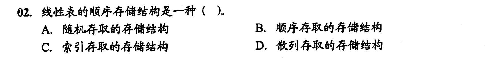

存取就是存取方式，也及时读写方式，顺序表就支持随机存取，根据初始地址+元素序号就可以随机读取到数据。

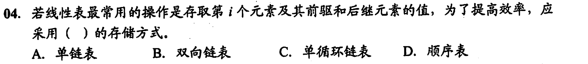

链表都需要从头开始查找，时间复杂度是O(n)的，只有顺序表是O(1)

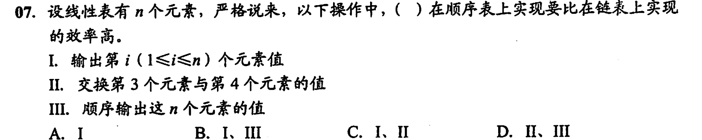

输出第i个元素的值，顺序表只需要O(1)，而链表需要O(n)。交换第3个和第4个元素的值，顺序表只需要3次即可，如果采用双向链表，从头开始找到第四个节点，直接前驱是第三个节点，这样才能交换元素，操作次数比顺序表要多。

==这一章的大题比较多，需要仔细研究==

## 2.3 线性表的链式表示

### 单链表的定义

单链表的优点：不要求大片的存储空间，改变容量方便；缺点：不可以随机存取，需要耗费一定容量来存放指针。

顺序表与单链表的比较：

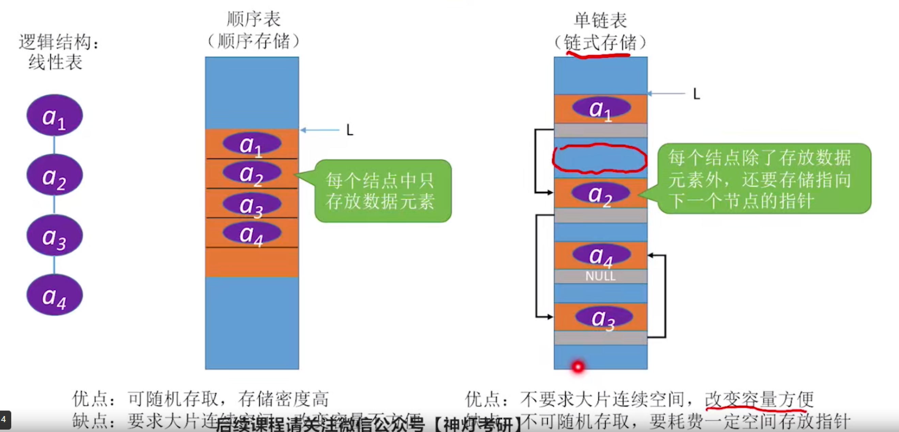

 **定义一个单链表**

```c++
struct LNode{
    ElemType e;
    struct LNode *next;
};
```

如何申请节点？

```c++
struct LNode *p = (struct LNode*) malloc(sizeof(struct LNode));
```

`typedef <数据类型> <别名>`

```c
typedef struct LNode LNode;
LNode *p = (LNode *)malloc(sizeof(LNode));
```

```c
typedef struct LNode{
    ElemType data;
    struct LNode *next;
}LNode, *LinkList;

// 其实这一部相当于：
struct LNode{
    ElemType data;
    struct LNode *next;
}
typedef struct LNode LNode;
typedef struct LNode *LinkList;

// 要声明一个单链表的时候，只需要声明一个头结点即可
LNode * L;
// 或者
LinkList L;

// 这里LNode * 等价于 LinkList
```

**强调这是一个单链表：LinkList；；强调这是一个指针：LNode *  **

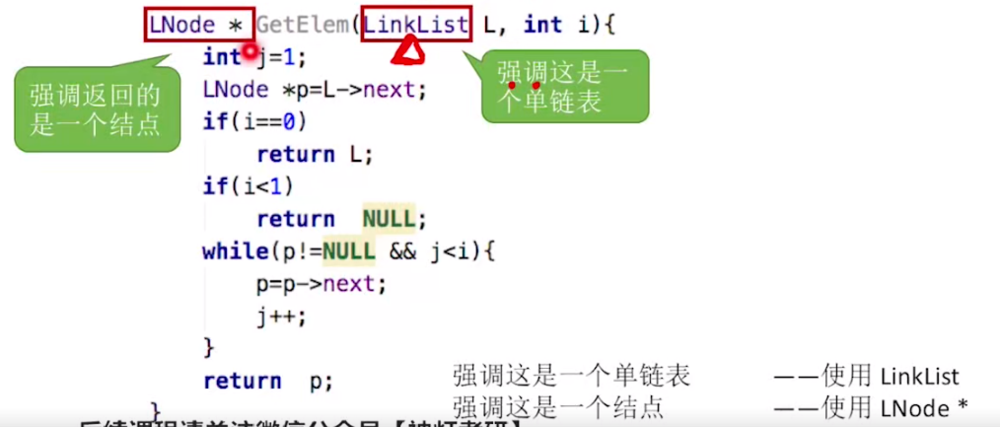

#### 单链表的两种实现

#### 带头节点

```c
typedef struct LNode{
    ElemType data;
    struct LNode *next;
}LNode, *LinkList;

// 初始化一个单链表（带头节点）
bool InitList(LinkList &L)
{
    L = (LNode *)malloc(sizeof(LNode));
    if(L == NULL) return false; // 内存不足
    L->next = NULL;
    return true;
}

// 判断是否为空
bool Empty(LinkList L)
{
    if(L->next == NULL) return true;
    else return false;
}
//简洁写法：
bool Empty(LinkList L)
{
    return (L->next == NULL);
}

void test()
{
    LinkList L;
    InitList(L);
}
```

#### 不带头结点

```c
typedef struct LNode{
    ElemType data;
    struct LNode *next;
}LNode, *LinkList;

// 初始化一个空的单链表（不带头结点）
bool InitList(LinkList &L)
{
    // 这里L传入的是头结点的引用；
    // 如果传入的不是引用，只是一个L的话，在这个函数域内，会新生成一个局部变量L
    // 这个局部变量是NULL，但是原来的传入的L还是没有变化。
    L = NULL;
    return true;
}
// 判断单链表是否为空
bool Empty(LinkList L)
{
    if(L == NULL) return true;
    else return false;
}
//简洁写法：
bool Empty(LinkList L)
{
    return (L == NULL);
}

void test()
{
    LinkList L;
    InitList(L);
}
```

带头节点的初始化的时候是先声明一个指针，这个指针是``LNode*``类型的指针，因为带有头结点，所以新建一个节点（L指向这个新的节点），初始化时候，就是当前头结点的``next``指向NULL；

不带头结点的初始化的时候就是申明一个指针，这个指针就是指向NULL（哪儿都不指向）的。不需要新生成一个节点。

**不管带不带头结点，头指针都是指向一个链表的第一个节点。**

### 单链表的基本操作的实现:star:

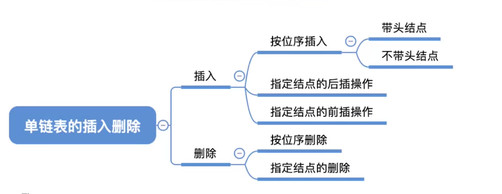

> 代码都要会写；体会带头节点和不带头结点的区别

#### 1. 单链表的建立

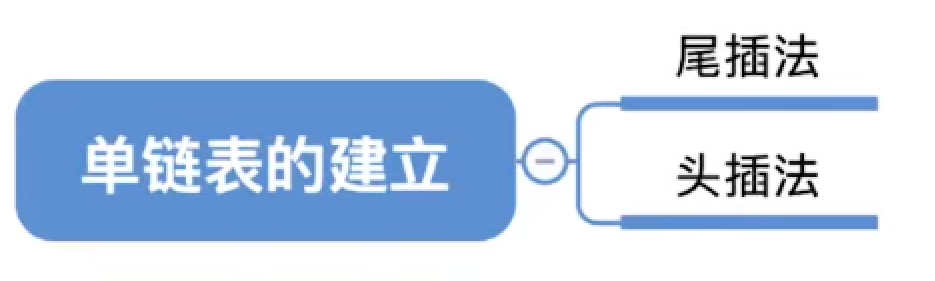

初始化一个带头节点的单链表：

```c
typedef struct LNode{
    ElemType date;
    struct LNode *next;
}LNode, *LinkList;

bool InitList(LinkList &L)
{
    L = (LNode*)malloc(sizeof(LNode));
    if(L == NULL) return false;
    L->next = NULL;
    return true;
}
```

##### 尾插法

尾插其实就是在最后一个节点后面插入，可以看一下[在指定节点后面插入元素](#####在指定的节点之后插入节点)

```c
bool InsertNextNode(LNode *p, ElemType e)
{
    if(p == NULL) return false;
    LNode *s = (LNode *)malloc(sizeof(LNode));
    if(s == NULL) return false; // 如果内存分配失败；当然考试的时候可以不写，但是得知道
    s->data = e;
    s->next = p->next;
    p->next = s;
    return true;
}
```

但是我们每一次尾插都需要最后一个节点的位置，因此我们需要一个尾指针时刻表明当前最后一个节点。

这里我们可以借助这个思想进行处理，只不过在尾插法的基础上时刻维护一个尾指针。

```c
LinkList List_TailInsert(LinkList &L) // 带头节点的尾插法
{
    int x;
    L= (LinkList)malloc(sizeof(LNode));
    LNode *s, *r = L; // 起初尾指针就在头结点的位置
    scanf("%d", &x);
    while(x != 9999) // 当x输入9999的时候结束
    {
        s = (LNode *)malloc(sizeof(LNode));
        s->data = x;
        r->next = s;
        r = s;
        scanf("%d", &x);
    }
    r->next = NULL; // 最后让尾节点的next指向NULL
    return L;
}
```

运行测试：

```c
[[include]] <stdio.h>
[[include]] <cstdlib>

typedef struct LNode{
    int data;
    struct LNode *next;
}LNode, *LinkList;

// 初始化一个单链表（带头节点）
bool InitList(LinkList &L)
{
    L = (LNode *)malloc(sizeof(LNode));
    if(L == NULL) return false; // 内存不足
    L->next = NULL;
    return true;
}

LinkList List_TailInsert(LinkList &L) // 带头节点的尾插法
{
    int x;
    L= (LinkList)malloc(sizeof(LNode));
    LNode *s, *r = L; // 起初尾指针就在头结点的位置
    scanf("%d", &x);
    while(x != 9999) // 当x输入9999的时候结束
    {
        s = (LNode *)malloc(sizeof(LNode));
        s->data = x;
        r->next = s;
        r = s;
        scanf("%d", &x);
    }
    r->next = NULL; // 最后让尾节点的next指向NULL
    return L;
}

void print(LinkList L)
{
    LNode *p = L->next;
    while(p != NULL)
    {
        printf("%d ", p->data);
        p = p->next;
    }
}
int main()
{
    LinkList L;
    InitList(L);
    List_TailInsert(L);
    print(L);
    return 0;
}


/*
输入 3 4 9999
输出 3 4
*/
```

不含有头结点：

```c
LinkList List_TailInsert(LinkList &L)
{
    int x;
    L = (LinkList)malloc(sizeof(LNode));
    LNode *s, *r = L;
    scanf("%d", &x);
    if(x != 9999)
    {
        r->data = x;
        scanf("%d", &x);
        while(x != 9999)
        {
            s = (LNode *)malloc(sizeof(LNode));
            s->data = x;
            r->next = s;
            r = s;
            scanf("%d", &x);
        }
    }
    else
    {
        L = NULL;
        return L;
    }
    r->next = NULL;
    return L;
}
```

##### 头插法

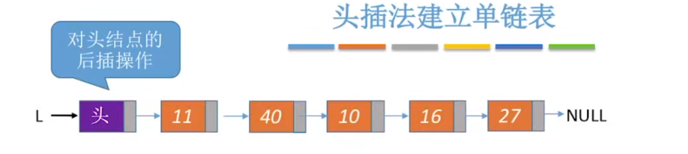

**头插法其实就是每一次都在头结点处进行尾插**

```c
LinkList List_HeadInsert(LinkList &L)
{
    LNode *s;
    int x;
    L = (LNode *)malloc(sizeof(LNode));
    L->next = NULL; // 注意这里初始化头结点的时候，next一定要指向NULL，如果没有，就会指向一个脏数据
    scanf("%d", &x);
    while(x != 9999)
    {
        s = (LNode *)malloc(sizeof(LNode));
        s->data = x;
        s->next = L->next;
        L->next = s;
        scanf("%d", &x);
    }
    return L;
}
```

运行测试：

```c
[[include]] <stdio.h>
[[include]] <cstdlib>
typedef struct LNode{
    int data;
    struct LNode *next;
}LNode, *LinkList;

LinkList List_HeadInsert(LinkList &L)
{
    LNode *s;
    int x;
    L = (LNode *)malloc(sizeof(LNode));
    L->next = NULL; // 注意这里初始化头结点的时候，next一定要指向NULL，如果没有，就会指向一个脏数据
    scanf("%d", &x);
    while(x != 9999)
    {
        s = (LNode *)malloc(sizeof(LNode));
        s->data = x;
        s->next = L->next;
        L->next = s;
        scanf("%d", &x);
    }
    return L;
}

void print(LinkList L)
{
    LNode *p = L->next;
    while(p != NULL)
    {
        printf("%d ", p->data);
        p = p->next;
    }
}

int main()
{
    LinkList L;
    List_HeadInsert(L);
    print(L);
    // InitList(L);
    return 0;
}

/*
输入 3 4 9999
输出 4 3
*/
```

不带头结点头插法：
其实每次都是在L前面插入节点。

```c
LinkList List_HeadInsert(LinkList &L)
{
    LNode *s;
    int x;
    L = (LNode *)malloc(sizeof(LNode));
    L = NULL; // 注意这里初始化一个不带头结点的链表，应该是L = NULL
    scanf("%d", &x);
    while(x != 9999)
    {
        s = (LNode *)malloc(sizeof(LNode));
        s->data = x;
        s->next = L;
        L = s;
        scanf("%d", &x);
    }
    return L;
}
```

#### 2. 插入

##### 带头结点的按位序插入

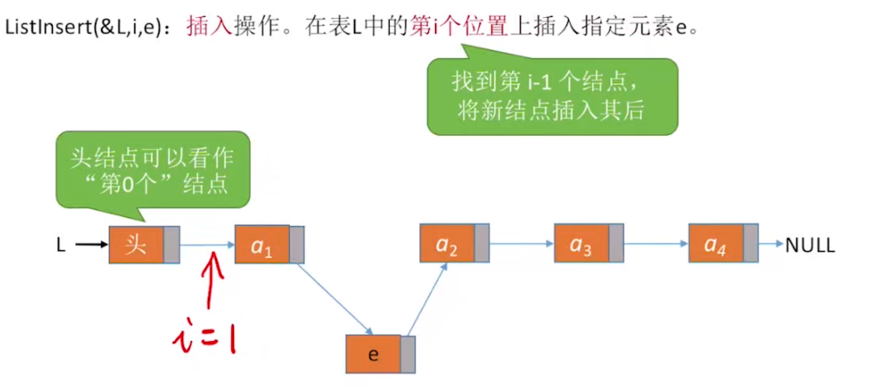

**在第i个位置插入元素e：**（其实就是在i-1 和i 之间插入元素）

```c
typedef struct LNode{
    int data;
    struct LNode * next;
}LNode, *LinkList;

// 在i-1 和i 之间插入元素
LinkList ListInsert(LinkList &L, int i, ElemType e)
{
    if(i < 1) return false; // 位置从1开始
    LNode *p;// 链表的扫描指针
    int j = 0; // 计数，找到i -1 和 i
    p = L; // 起初 p指向头结点
    while(p != NULL && j < i - 1)
    {
        p = p->next;
        j++;
    }
    if(p == NULL) return false; // i的值不合法
    LNode *s = (LNode *)malloc(sizeof(LNode));
    s->data = e;
    s->next = p->next;
    p->next = s;
    return true;
}
```

利用这种方式去插入的平均时间复杂度是O（n）

##### 不带头节点的按位序插入

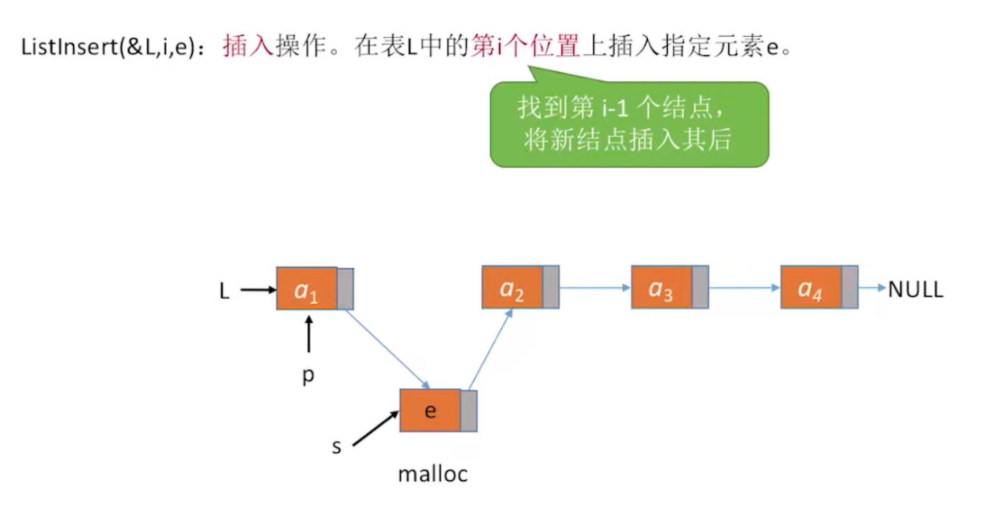

```c
bool ListInsert(LinkList &L, int i, ElemType e)
{
    if(i < 1) return false; // 位置从1开始
    if(i == 1)
    {
        // 在第一个位置插入其实就是在原来的链表的第一个元素之前插入一个元素
        LNode *s = (LNode*)malloc(sizeof(LNode));
        s->data = e;
        s->next = L;
        L = s;
        return true;
    }
    LNode *p;
    int j = 1; // 这里与带头节点的不同
    p = L;
    while(p != NULL && j < i - 1)
    {
        p = p->next;
        j++;
    }
    if(p == NULL) return false; // i的值不合法
    LNode *s = (LNode *)malloc(sizeof(LNode));
    s->data = e;
    s->next = p->next;
    p->next = s;
    return true;
}
```

时间复杂度都是O(1)的。

##### 在指定的节点之后插入节点

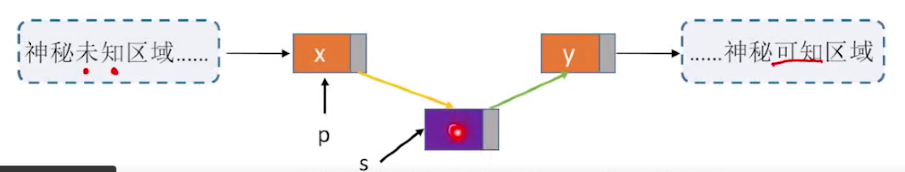

```c
bool InsertNextNode(LNode *p, ElemType e)
{
    if(p == NULL) return false;
    LNode *s = (LNode *)malloc(sizeof(LNode));
    if(s == NULL) return false; // 如果内存分配失败；当然考试的时候可以不写，但是得知道
    s->data = e;
    s->next = p->next;
    p->next = s;
    return true;
}
```

时间复杂度是O(1)

因此对于按位序插入我们可以这样处理：

```c
LinkList List_HeadInsert(LinkList &L, int i, ElemType e)
{
    if(i < 1) return false; // 位置从1开始
    LNode *p;// 链表的扫描指针
    int j = 0; // 计数，找到i -1 和 i
    p = L; // 起初 p指向头结点
    while(p != NULL && j < i - 1)
    {
        p = p->next;
        j++;
    }
    return InsertNextNode(p, e); // 其实还是在i - 1位置插入
}
```

**在指定节点前插入**

第一种方法就是找到当前节点的前驱结点（从头结点开始遍历，当节点的->next = 要插入的节点的时候），这样时间复杂度是O(n)的。

但是我们可以曲线救国！

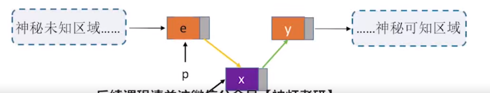

```c
bool InsertPriorNode(LNode *p, ElemType e)
{
    if(p == NULL) return false;
    LNode *s=(LNode*)malloc(sizeof(LNode));
    if(s == NULL) return false;
    s->next = p->next;
    p->next = s;
    s->data = p->data;
    p->data = e;
    return true;
}
```

这样时间复杂度是O(1)

#### 3. 删除

##### 带头节点的按位序删除

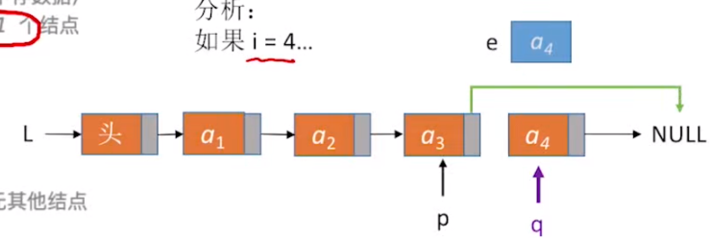

```c
bool ListDelete(LinkList &L, int i, ElemType &e)
{
    if(i < 1) return false;
    LNode *p;
    int j = 0;
    p = L;
    // 其实还是在第i-1后删除节点
    while(p != NULL && j < i - 1)
    {
        p = p->next;
        j++;
    }
    if(p == NULL) return false;
    if(p->next == NULL) return false; // 第i - 1个节点之后没有节点了，就不需要删除了
    LNode * q = p->next;
    e = q->data; // 返回删除的元素
    p->next = q->next;
    free(q); // 释放节点q
    return true;
}
```

时间复杂度为O(n)

##### 不带头节点的按位序删除

```c
// 其实是删除i -1 后的节点
bool ListDelete(LinkList &L, int i, ElemType &e)
{
    if(i < 1) return false;
    if(i == 1)
    {
        LNode *p = L;
        e = p->data;
        L = L->next;
        free(p);
        return true;
    }
    LNode *p;
    int j = 1;
    p = L;
    while(p != NULL && j < i - 1)
    {
        p = p->next;
        j++;
    }
    if(p == NULL) return false;
    if(p ->next == NULL) return false;
    LNode *q = p->next;
    e = q->data;
    p->next = q->next;
    free(q);
    return true;
}
```

##### 在指定节点后删除节点<在最后一个节点后删除O(1)的方法会报错>

* 第一种方法就是找到指定节点的前驱结点，然后删除当前的节点，但是这样的时间复杂度是O(n)
* 第二种就是当前节点与下一个节点交换数据域，（曲线救国）这样时间复杂度是O(1)

```c
bool Delete(LNode *p)
{
    if(p == NULL) return false;
    LNode * q = p->next;
    p->data = p->next->data;
    p->next = q->next;
    return true;
}
```

**如果删除的是最后一个元素，那么第二种方法就会失效（只能采用第一种方法）**

#### 4. 查找

##### 按位查找

```c
LNode * GetElem(LinkList L, int i)// 带头节点
{
    if(i < 0) return NULL;
    LNode *p;
    int j = 0;
    p = L;
    while(p != NULL && j < i) // 循环到i节点
    {
        p = p->next;
        j++;
    }
    return p;
}
```

##### 按值查找

```c
LNode * GetElem(LinkList L, ElemType e)
{
    LNode * p = L->next;
    while(p != NULL && p->data != e)
        p = p->next;
    return p;
}
```

返回第一个等于e的指针

#### 5. 求单链表的长度

```c
int length(LinkList L) // 带头节点
{
    int len = 0;
    LNode * p = L:
    while(p->next != NULL)
    {
        p = p->next;
        len++;
    }
    return len;	
}
```

查找和求单链表的长度都是O(n)的。

### 双链表:star:

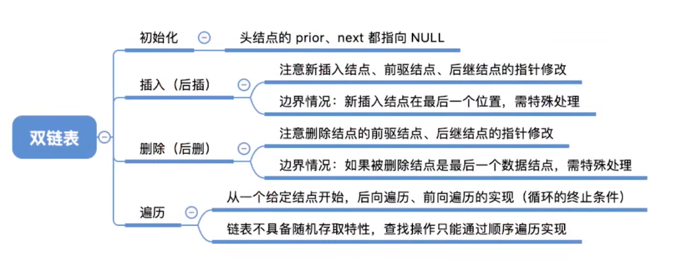

#### 1. 单链表和双链表的比较

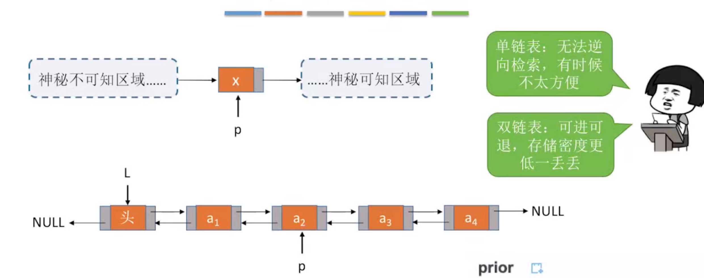

#### 2. 如何定义一个双链表？

```c
typedef struct DNode{
    ElemType data;
    struct DNode *prior, *next;
}DNode, *DLinkList;
```

> 这里的D表示Double的意思
>
> DLinkList 等价于 *DNode

#### 3. 如何初始化一个双链表？

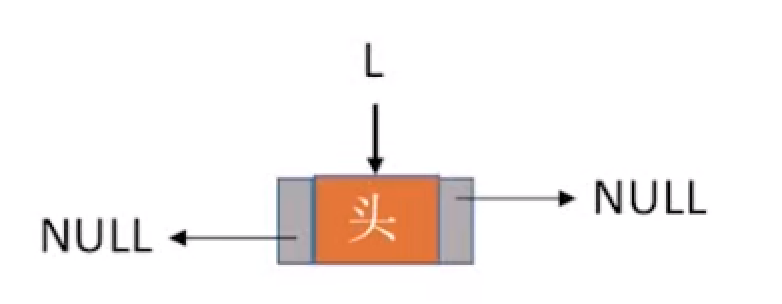

```c
// 带头节点的双链表的初始化
typedef struct DNode{
    ElemType data;
    struct DNode *prior, *next;
}DNode, *DLinkList;

bool InitDLinkList(DLinkList &L)
{
    L = (DNode *) malloc(sizeof(DNode));
    if(L == NULL) return false; // 内存申请失败
    L->prior = NULL; // 头结点的prior永远指向NULL
    L->next = NULL;
    return true;
}
```

#### 4. 判断是否为空？

```c
bool Empty(DLinkList L)
{
    if(L->next == NULL) return true;
    else return false;
}
```

#### 5. 后插法插入一个节点

```c
bool InsertNextDNode(DNode *p, DNode *s)
{
    if(p == NULL || s == NULL) return false; // 传入的参数不合法
    s->next = p->next;
    if(p->next != NULL) p->next->prior = s;// 防止p的下一个节点是NULL节点
    s->prior = p;
    p->next = s;
    return true;
}
```

因为双链表中的节点可以指向前后的节点，因此往前插法可以转换成后插。

#### 6. 双链表的删除

删除p节点后的q节点：

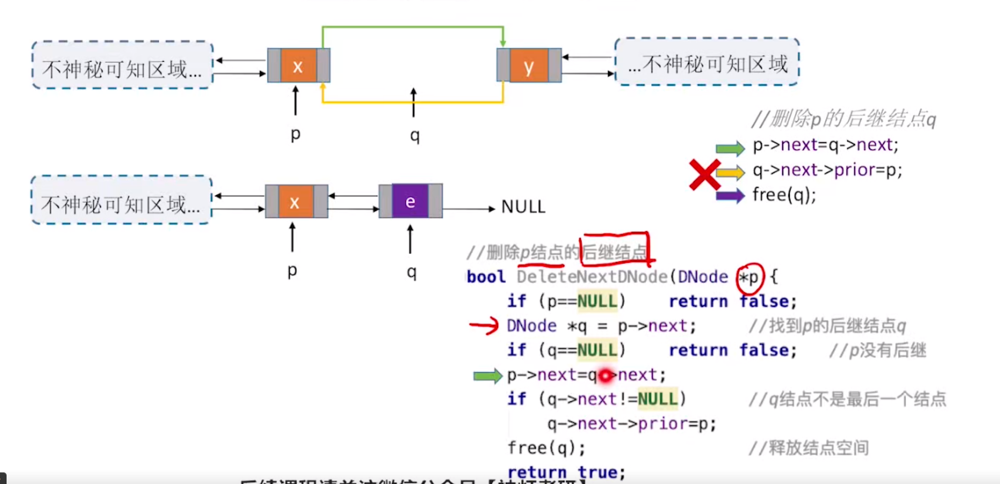

```c
// 删除p节点后面的q节点
bool DeleteNextDNode(DNode *p)
{
    if(p == NULL) return false;
    DNode *q = p->next; // 找到p的后继节点q，我们的目的就是删除q
    if(q == NULL) return false; // p后面没有后继节点
    p->next = q->next;
    if(q->next != NULL) q->next->prior = p; // q节点不是最后一个节点
    free(q);
    return true;
}
```

#### 7. 销毁一个双链表

```c
void DestoryList(DLinkList &L)
{
    while(L->next !- NULL) DeleteNextDNode(L); // 每次都是删除头结点后的节点
    free(L);
    L = NULL;
}
```

#### 8. 遍历双链表

```c
// 后向遍历
while(p != NULL)
{
    // print the LinkList;
    p = p->next;
}

// 前向遍历
while(p != NULL)
{
    // print the LinkList;
    p = p->prior;
}

// 前向遍历跳过头结点
while(p->prior != NULL)
{
    // print the LinkList;
    p = p->prior;
}
```

#### 9. 时间复杂度

双链表的位置不可以随机取到，**按位查找、按值查找操作只能使用遍历的方式实现**。时间复杂度是O(n)。

### 循环列表:star:

#### **循环单链表**

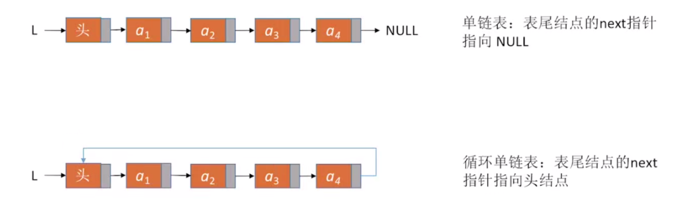

```c
typedef struct LNode{
    ElemType date;
    struct LNode *next;
}LNode, *LinkList;

// 初始化一个循环单链表
bool InitList(LinkList &L)
{
    L = (LNode*)malloc(sizeof(LNode));
    if(L == NULL) return false;
    L->next = L; // 头结点的next指针指向头结点
    return true;
}

// 判断单链表是否为空
bool Empty(LinkList L)
{
    if(L->next == L)
        return true;
    else return false;
}

// 判断单链表中当前的节点是否是最后一个节点
bool isTail(LinkList L, LNode *p)
{
    if(p->next == L) return true;
    else return false;
}
```

在之前我们遍历单链表的时候，对于当前的节点前面的区域都是未知的；但是有了循环链表之后，对于前面的区域我们可以通过循环找到这个前驱结点。

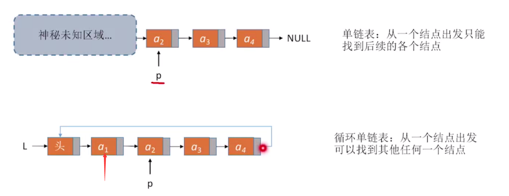

我们其实很容易发现，对于循环单链表，如果在链表的尾部插入元素，那么所需要的时间复杂度就是O(1)的。所以对于**尾结点操作次数多的情况，可以考虑循环单链表**。

#### **循环双链表**

```c
typedef struct DNode{
    ElemType data;
    struct DNode *prior, *next;
}DNode, *DLinkList;

// 初始化空的循环双链表
bool InitDLinkList(DLinkList &L)
{
    L = (DNode *) malloc(sizeof(DNode));
    if(L == NULL) return false; // 内存申请失败
    L->prior = L; // 头结点的prior指向L
    L->next = L; //  头结点的next指向L
    return true;
}

// 判断是否为空
bool Empty(DLinkList L)
{
    if(L->next == L) return true;
    else return false;
}

// 判断是否是尾指针
bool isTail(DLinkList L, DNode *p)
{
    if(p->next == L) return true;
    else return false;
}
```

初始化一个循环双链表：

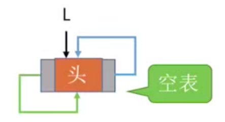

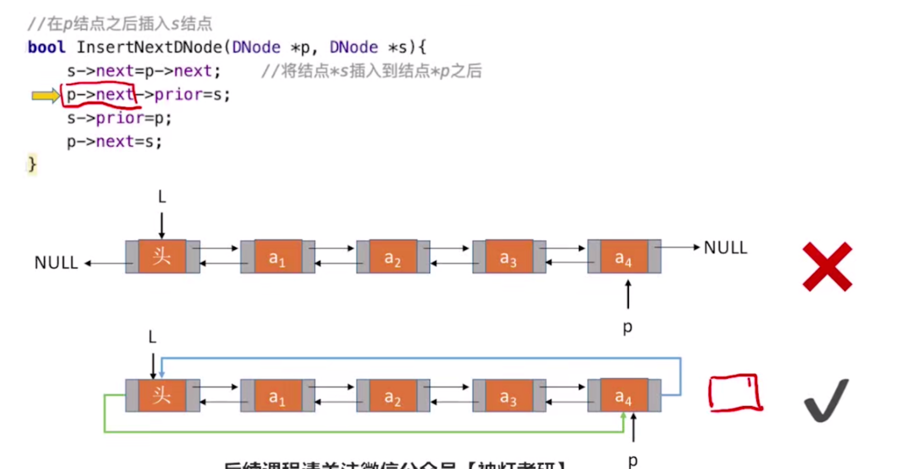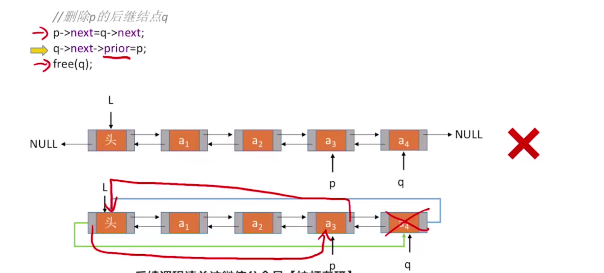

### 静态链表

我们在上面的单链表里可以发现每一个数据元素在内存中都是分散的；但是这部分提到的静态链表要求分配一整片连续的内存空间；

单链表：

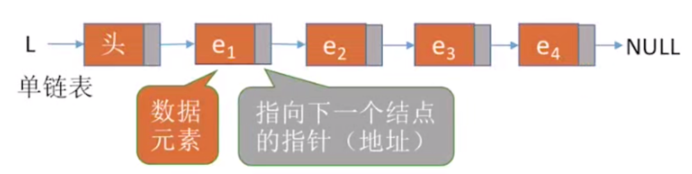

静态链表：

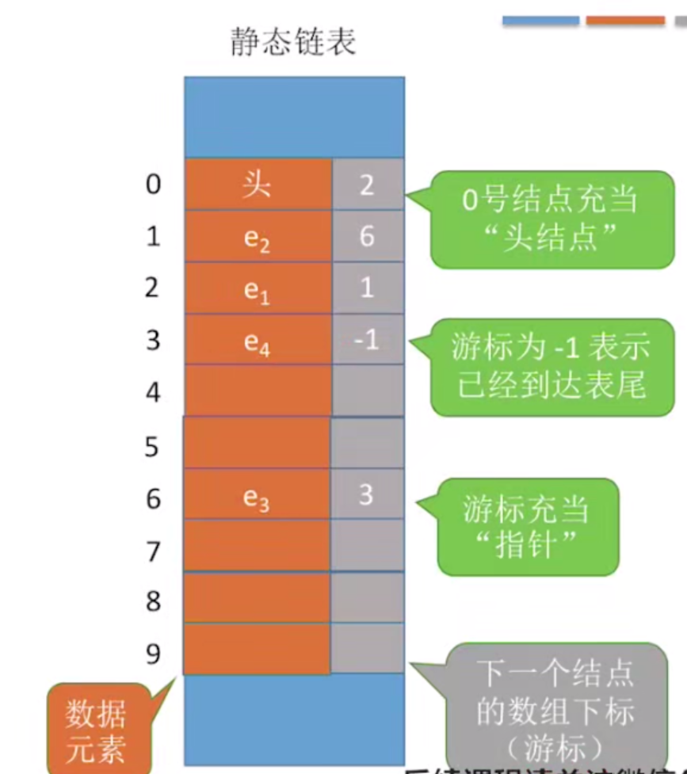

假如说每一个数据元素的4B，游标也是4B；那么每一个数据元素就是8B；

设起始地址为addr：

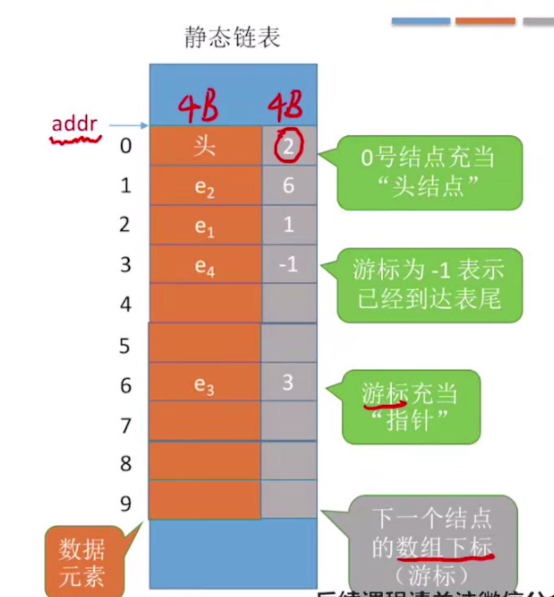

那么e~1~的地址就是addr + 2 * 4

#### 如何定义一个静态链表

```c
[[define]] MAX 10
struct Node{
	ElemType data; // 存储数据元素
    int next;	// 存储游标
}

// 如何声明一个数组？
struct Node a[MAX];
```

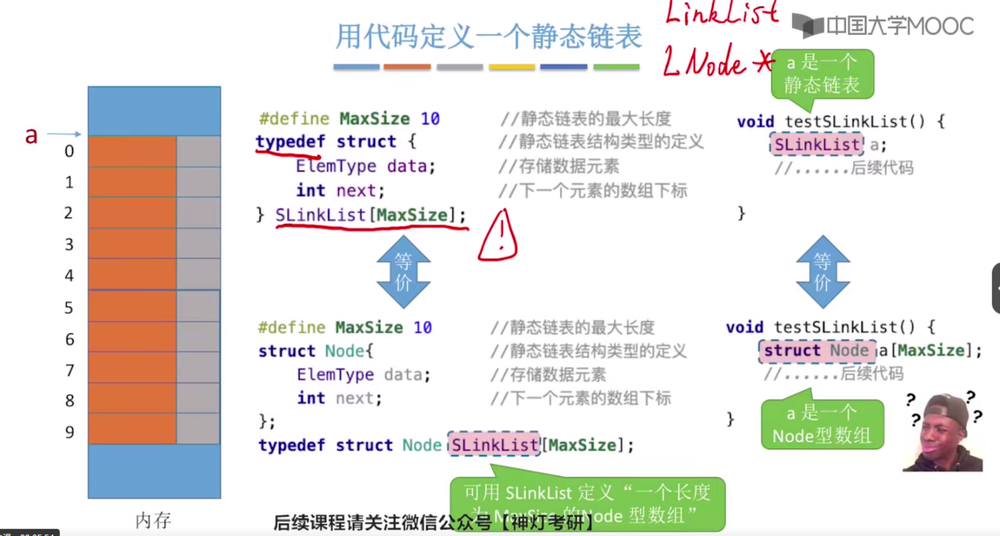

但是在数据结构辅导书上是这样定义一个静态链表的：

```c
[[define]] MaxSize 10
typedef struct {
    ElemType data;
    int next;
}SLinkList[MaxSize];

//如果这样去定义的话，每一次生命一个静态链表的时候只能这样去声明
SLinkList a;
// 这里的a其实就是一个大小为[MaxSize]的静态链表
// 等价于前面的这样声明：
struct Node a[MAX];
```

如何证明这样的结果是正确的呢？

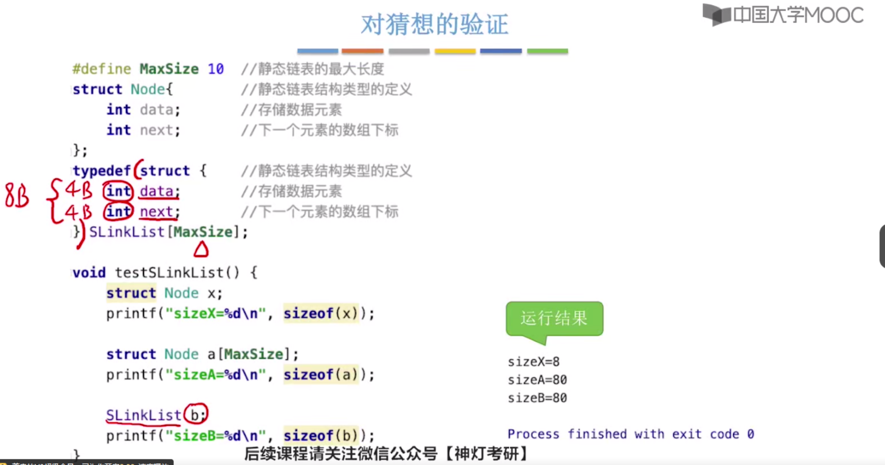

#### 初始化一个静态链表

```c
void InitList(SLinkList &L)
{
    L[0].next = -1;
    // 开辟一块内存，并不是代表里面没有数据，只不过这些数据都是脏数据，所以这里采用一个特殊的数字-2（当然也可以是其他的小于-1的负数）
    for(int i = 0; i < MaxSize; i++)
    {
        L[i].next = -2;
	}
}
```

#### 查找

```c
void SearchList(SLinkList L)
{
    for(int i = s[0].next; i != -1; i = s[i].next)
    {
        printf("%d", s[i].data);
    }
}
```

#### 在某一个位序里插入元素

```c
/*
* 找到一个空节点，如何找到这个空节点？next为-2的
* 从头结点开始遍历找到i - 1的
* 修改新节点的next
* 修改i - 1的next
*/
```

#### 删除某一个节点

```c
/*
* 删除某一个节点
* 从头开始出发找到前驱结点
* 修改前驱结点的next
* 将被删除节点的next置换为-2（表示free）
*/
```

优点:增、删操作不需要大量移动元素
缺点:不能随机存取，只能从头结点开始依次往后查找;**容量固定不可变**

### 顺序表和链表的比较

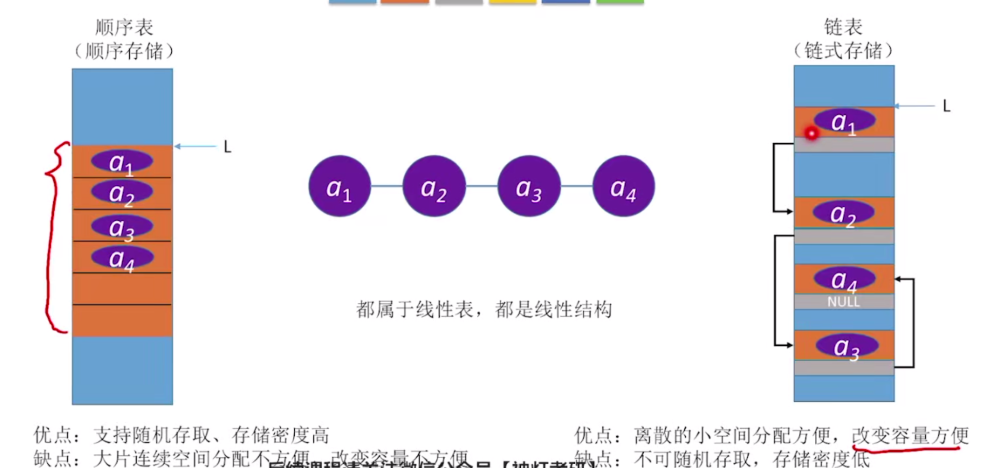

* 在创建表时：

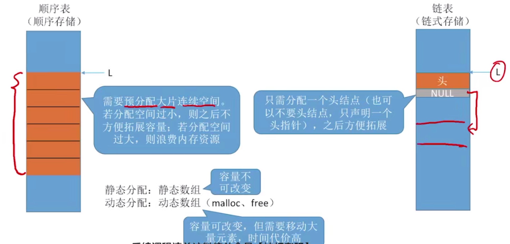

* 销毁

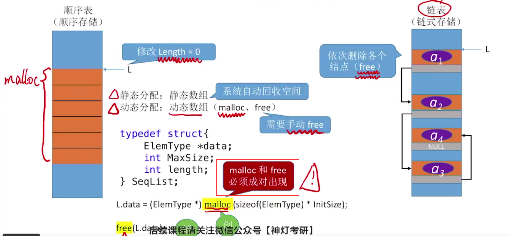

注意`malloc`是在堆区里申请，必须需要一个free来销毁，并且需要程序员手动的销毁

* 增加或者删除

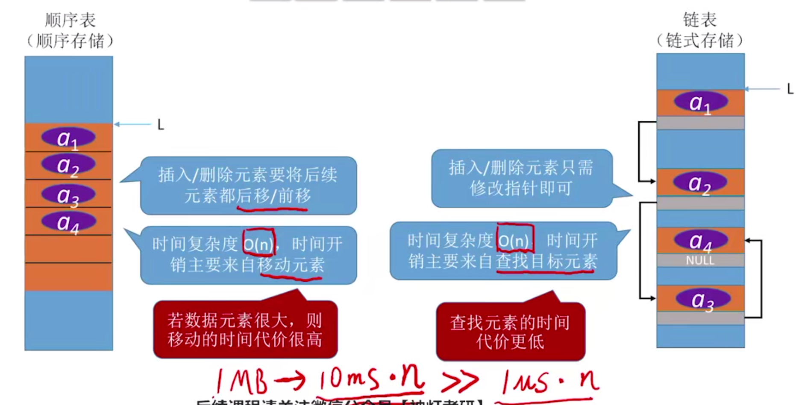

* 查找

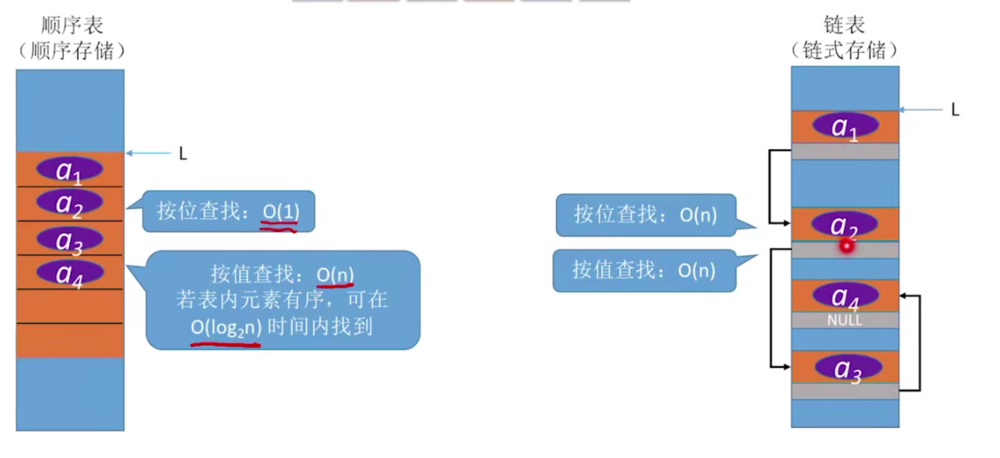

**如果表长难以估计并且插入和删除的次数比较多，采用链表合适**

**如果表长可以估计，并且查询次数比较多**

# 第三章 栈和队列

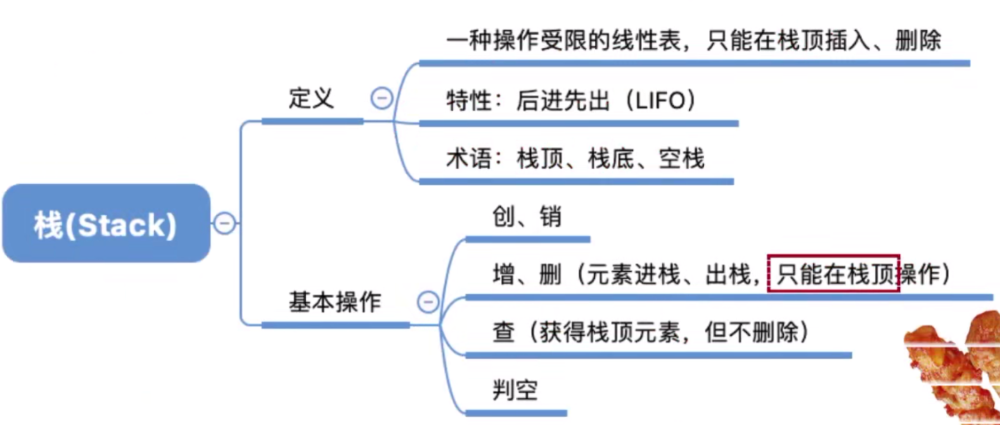

## 栈的基本概念

栈只允许==在一端进行插入和删除操作==的线性表

特点：先进后出（LIFO）Last in First out

对栈的基本概念的考察：

给定某一个进栈顺序，让我们求解有哪些合法的出栈顺序。

n个不同元素进栈，出栈元素的不同排列个数为$$\frac{1}{n+1}C_{2n}^{n}$$，这就是卡特兰数。考试的时候不会直接写出一个全部所有的出栈顺序，会出现在选择题，判断出栈顺序是否合法。

## 栈的顺序存储的实现

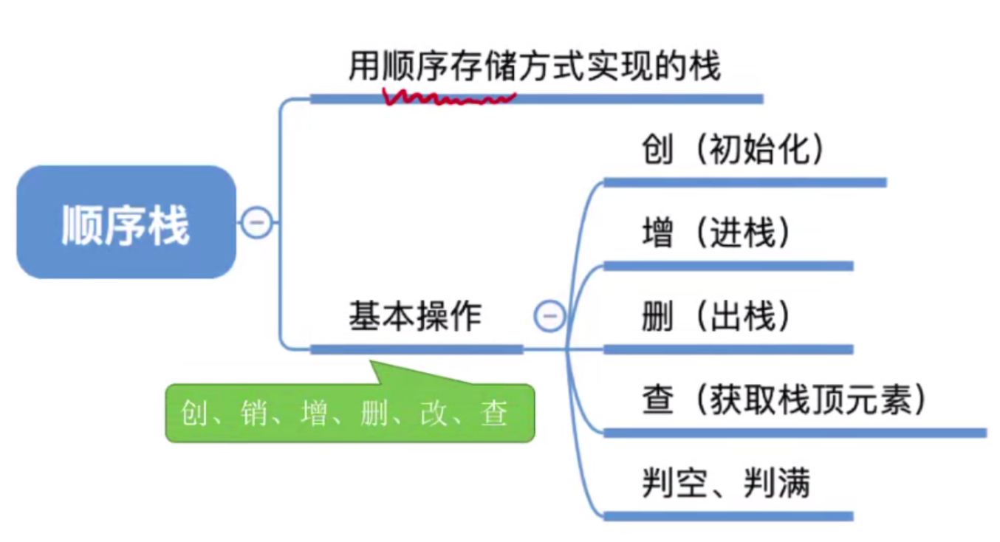

### 1.定义一个栈

```c
[[define]] MaxSize 10
typedef struct
{
    ElemType data[MaxSize];
    int top;
} SqStack;
```

这样我们定义一个静态链表的栈的时候，内存里的描述是这样的：
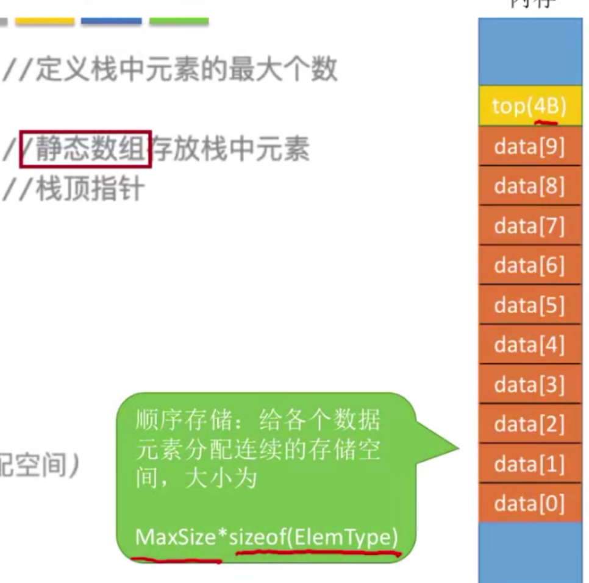

### 2.初始化栈

```c
void InitStack(SqStack &S)
{
    S.top = -1;
}
```

### 3.判断栈是否为空

```c
bool StackEmpty(SqStack S)
{
    if(S.top == -1) return true;
    else return false;
}
```

### 4.入栈操作

```c
bool Push(SqStack &S, ElemType x)
{
    if(S.top == MaxSize - 1) return false; // 栈满了，不能再继续添加了；
    S.data[++S.top] = x;
    return true;
}
```

### 5.出栈操作

```c
bool Pop(SqStack &S, ElemType &x)
{
    if(S.top == -1) return false;
    x = S.data[S.top--]; // 这里是在内存中新开一个x，x保存删除的栈顶元素
    return true;
}
```

### 6.读取栈顶元素

```c
bool GetTop(SqStack &S, Elemtype &x)
{
    if(S.top == -1) return false;
    x = S.data[S.top];
    return true;
}
```

我们应该注意的一点就是这里top指向的是栈顶元素，所以进栈操作为s.data[ ++S.top]=x，出栈操作为x=S.data [S.top--]。若栈顶指针初始化为S.top=0，即top指向栈顶元素的下一位置，则入栈操作变为s.data[S.top++]=x;出栈操作变为x=S.data[--s.top]。栈空就是top == 0栈满就是top == MaxSize 

### 共享栈

因为直接开辟一大片的存储空间这样可能会比较浪费存储空间，我们可以利用栈的特性，在一端进行操作，因此我们可以使用一段连续的存储空间的两端进行栈操作：

```c
[[define]] MaxSize 10
typedef struct{
    ElemType data[MaxSize];
    int top0;
    int top1;
}SqStack;

// 初始化栈：
bool InitStack(SqStack &S)
{
    S.top0 = -1;
    S.top1 = MaxSize;
    return true;
}
```

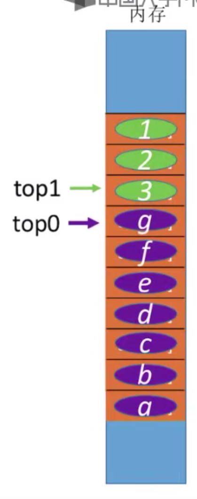

==栈满的条件：==`S.top0 + 1 = S.top1`

总结：

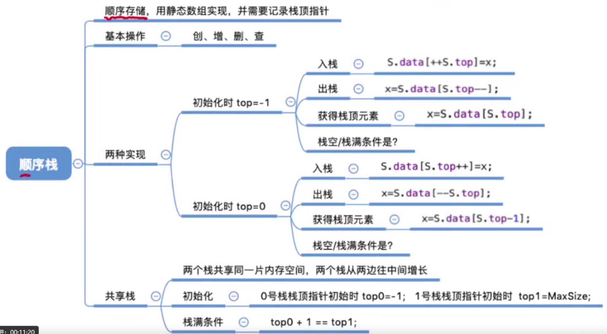

##  栈的链式存储的实现

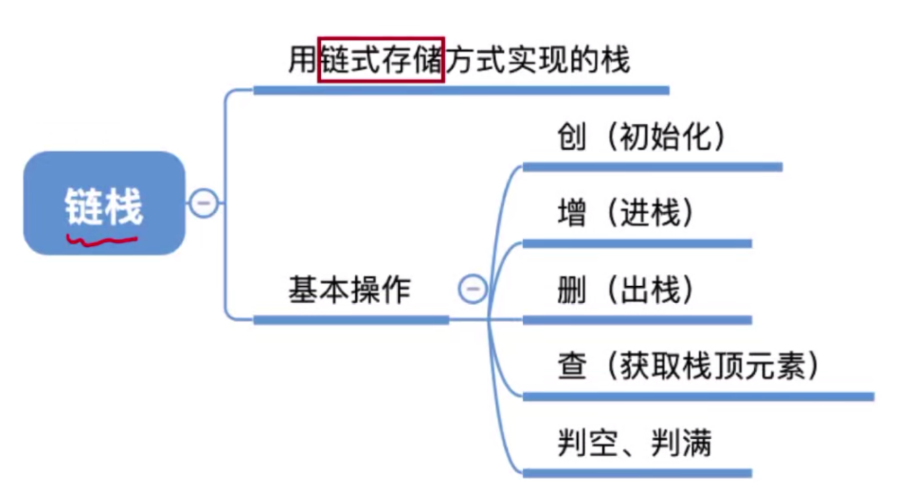

### 带头节点

```c
// 栈的链式存储的定义
typedef struct LNode{
    ElemType data;
    struct LNode *next;
}LNode, *LiStack;

// 栈的链式存储的初始化
bool InitStack(LiStack &S)
{
    S = (LNode *)malloc(sizeof(LNode));
    if(s == NULL) return false;
    S->next = NULL;
    return true;
}

// 判断栈是否为空
bool EmptyStack(LiStack S)
{
    if(S->next == NULL) return true;
    else return false;
}

// 增加元素
LiStack Push(LiStack &S, ElemType e)
{
    a = (LNode *)malloc(sizeof(LNode));
    a->data = e;
    a->next = S->next;
    S->next = a;
    return S;
}

// 出栈操作
bool Pop(LiStack &S, ElemType &e)
{
    if(S->next == NULL) return false;
    LNode p = S->next;
    e = p->data;
    S->next = p->next;
    free(p);
  	return true;
}

// 读取栈顶元素
bool GetTop(SqStack &S, Elemtype &x)
{
    if(S->next == NULL) return false;
    x = S->next->data;
    return true;
}
```

### 不带头结点

```c
// 栈的链式存储的定义
typedef struct LNode{
    ElemType data;
    struct LNode *next;
}LNode, *LiStack;


// 栈的链式存储的初始化
bool InitStack(LiStack &S)
{
    S = NULL;
    return true;
}

// 判断栈是否为空
bool EmptyStack(LiStack S)
{
    if(S == NULL) return true;
    else return false;
}

// 增加元素
LiStack Push(LiStack &S, ElemType e)
{
    a = (LNode *)malloc(sizeof(LNode));
    a->data = e;
    a->next = S;
    S = a;
    return S;
}

// 出栈操作
bool Pop(LiStack &S, ElemType &e)
{
    if(S == NULL) return false;
    LNode p = S;
    S = S->next;
    e = p->data;
    free(p);
  	return true;
}

// 读取栈顶元素
bool GetTop(SqStack &S, Elemtype &x)
{
    if(S == NULL) return false;
    x = S->data;
    return true;
}
```

## 队列的基本概念

==先进先出==First In First Out(FIFO)

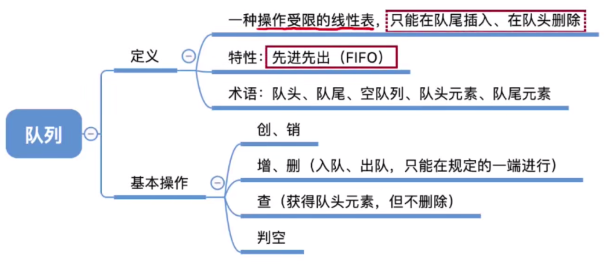

## 队列的顺序实现的操作

```c
//定义一个队列的顺序实现
[[define]] MaxSize 10
typedef struct {
    ElemType data[MaxSize];
    int front, int rear;
} SqQueue;

// 初始化一个队列
void InitQueue(SqQueue &Q)
{
    Q.rear = Q.front = 0;
}

// 判断队列是否为空
bool EmptyQueue(SqQueue Q)
{
    if(Q.rear == Q.front) return true;
    else return false;
}
```

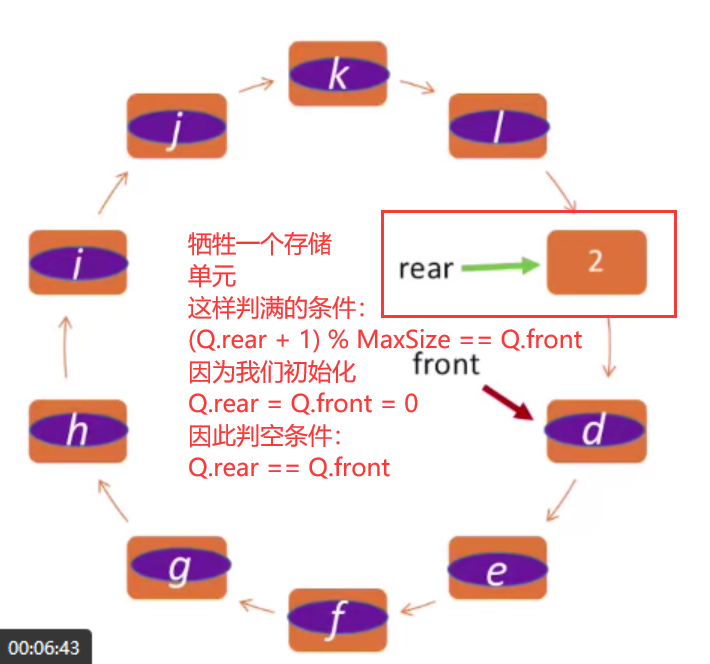

```c
// 入队操作
bool EnQueue(SqQueue &Q, ElemType x)
{
    if((Q.rear + 1) % MaxSize == Q.front) return false; // 队满则报错
    Q.data[Q.rear] == x;
    Q.rear = (Q.rear + 1) % MaxSize; // 利用模运算，我们把存储空间变成了环状的
    return true;
}
```

```c
// 出队操作
bool DeQueue(SqQueue &Q, ElemType &x)
{
    if(Q.rear == Q.front) return false;
    x = Q.data[Q.front];
    Q.front = (Q.front + 1) % MaxSize;
    return true;
}
```

```c
// 获得堆头的元素
bool GetHead(SqQueue Q, ElemType &x)
{
    if(Q.rear == Q.front) return false;
    x = Q.data[Q.front];
    return true;
}
```

**队列元素的个数：(rear + MaxSize - front) % MaxSize**

我们注意到我们这样处理的话会浪费一个存储空间，如果不浪费的话，那么我们判满和判空的条件就要发生改变，因此我们可以采用以下两种方法进行处理：

* 定义的时候增加一个size变量表示当前队列的长度：
  ```c
  //定义一个队列的顺序实现
  [[define]] MaxSize 10
  typedef struct {
      ElemType data[MaxSize];
      int front, int rear;
      int size;
  } SqQueue;
  ```

  因此我们判满就可以使用`size == MaxSize` 判空 `size == 0`

* 定义的时候定义一个标签，表示最近一个是删除还是增加（每一次删除成功的时候tag = 0； 每一次增加成功的时候tag = 1）只有删除操作才能导致队列为空；只有增加操作才能导致队列为满

  ```c
  //定义一个队列的顺序实现
  [[define]] MaxSize 10
  typedef struct {
      ElemType data[MaxSize];
      int front, int rear;
      int tag;
  } SqQueue;
  ```

  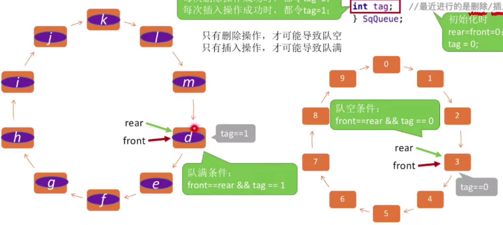

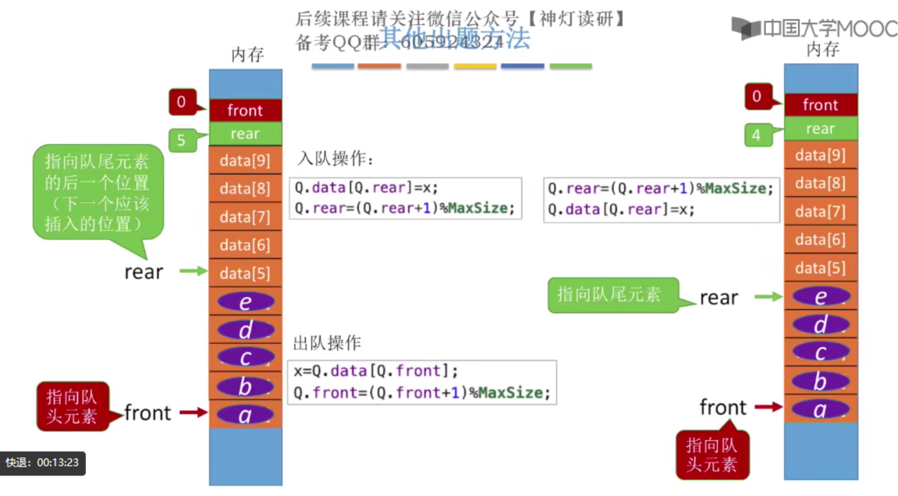

因此我们初始化的时候：

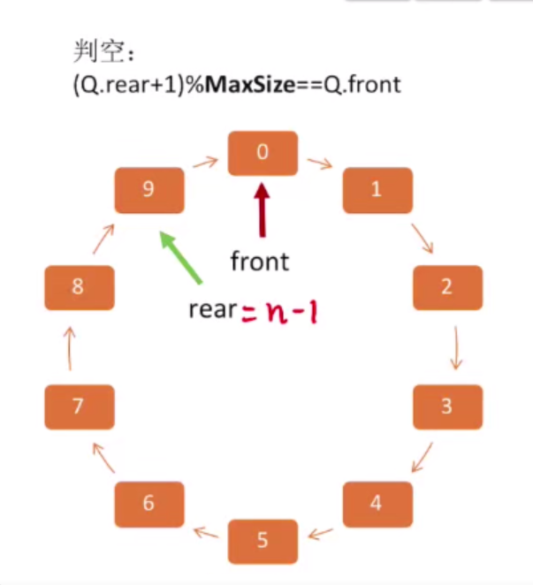

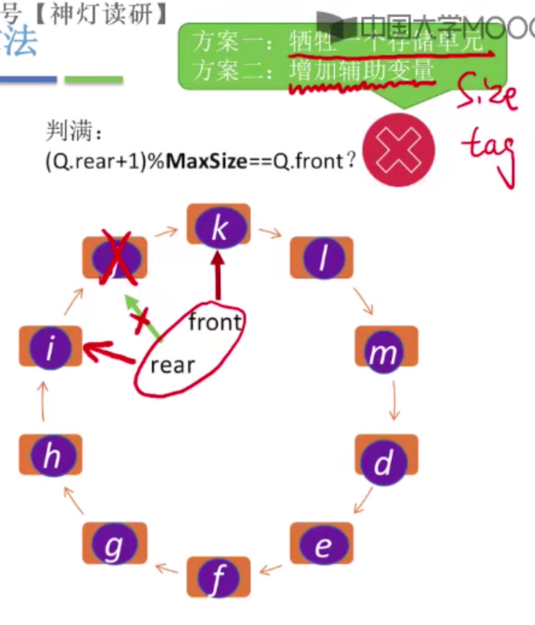

### 总结


## 队列的链式实现

```c
// 定义
typedef struct LinkNode{
    ElemType data;
    struct LinkNode *next;
}
typedef struct{
    LinkNode *front, *rear;
}LinkQueue;
```


```c
// 带头结点
void InitQueue(LinkQueue &Q)
{
    Q.front = Q.rear = (LinkNode *)malloc(sizeof(LinkNode));
    Q.front->next = NULL;
}

// 不带头结点初始化
void InitQueue(LinkQueue &Q)
{
    Q.front = NULL;
    Q.rear = NULL;
}

// 带头结点判空
bool EmptyQueue(LinkQueue Q)
{
    if(Q.front->next == NULL) return true;
    else return false;
}

// 不带头节点判空
bool EmptyQueue(LinkQueue Q)
{
    if(Q.front == NULL) return true;
    else return false;
}
```

```c
// 带头结点入队
void EnQueue(LinkQueue &Q, ElemType x)
{
    LinkNode *s = (LinkNode *)malloc(sizeof(LinkNode));
    s->data = x;
    s->next = NULL; // 是否Q.rear->next也可以呢？这里是在表尾插入，所以每次s下一个都是NULL
    Q.rear->next = s;
    Q.rear = s;
}

// 不带头结点入队
void EnQueue(LinkQueue &Q, ElemType x)
{
    LinkNode *s = (LinkNode *)malloc(sizeof(LinkNode));
    s->data = x;
    s->next = NULL; // 
    if(Q.front == NULL) // 此时插入的是第一个节点 ,要特殊处理
    {
        Q.front = s;
        Q.rear = s;
	}
    else
    {
        Q.rear->next = s;
    	Q.rear = s;
    }
}

// 带头结点出队操作
bool DeQueue(LinkQueue &Q, ElemType &x)
{
    if(Q.front == Q.rear) return false;
    LinkNode *p = Q.front->next;
    x = p->data;
    Q.front->next = p->next;
    if(Q.rear = p) Q.rear = Q.front; // 如果队列里只有一个元素，要将rear指针更新到头结点
    free(p);
    return true;
}

// 不带头结点
bool DeQueue(LinkQueue &Q, ElemType &x)
{
    if(Q.front == NULL) return false;
    LinkNode *p = Q.front;
    x = p->data;
    Q.front = p->next;
    if(Q.rear = p)// 如果队列里只有一个元素，要将rear指针
    {
        Q.rear = NULL;
    }
    free(p);
    return true;
}
```

## 双端队列

双端队列也是一种操作受限的线性表


## 栈和队列的应用

### 栈在括号匹配中的应用


使用顺序栈实现起来比较简单，如果存储空间不够的话可以考虑使用链栈。

如果不是单独定义一个栈，只是定义一个数组和top指针，如何实现？

```c
[[define]] MaxSize 10

bool bracketCheck(char str[], int length)
{
    char data[MaxSize];
    int top = -1;
    for(int i = 0 ; i < length; i++)
    {
        if(str[i] == '{' || str[i] == '[' || str[i] == '(')	data[++top] = str[i];
        else
        {
            if(top == -1) return false;
            char gettop = data[top];
            top--;
            if(str[i] == ')' && gettop != '(') return false;
            if(str[i] == ']' && gettop != '[') return false;
            if(str[i] == '}' && gettop != '{') return false;
        }
    }
    if(top == -1) return true;
    else return false;
}
```

### 栈在表达式求值中的应用


考察后缀表达式:star: ，与前缀中缀的转换;

> 后缀表达式又叫逆波兰式；前缀叫波兰式


**注意前缀表达式**


#### 总结


### 如何机算实现从中缀表达式到后缀表达式？


### 利用栈实现中缀表达式的求值


### 栈用于表达式求值的总结


### 栈在递归中的应用

函数调用的特点就是最后被调用的函数是最先执行结束（LIFO）

函数调用的时候，需要使用栈来存储：

* 调用返回地址
* 实参
* 局部变量


### 队列的应用----树的层次遍历

### 队列的应用----图的广度优先遍历

## 矩阵的压缩存储

> 2023年4月13日20:27:52
>
> 突然发现自己变成截图怪了


二维数组可以采用行优先或者列优先两种方式进行存储：


### 矩阵的存储

#### 对称矩阵的存储


如果采用列优先存储呢？


#### 三角矩阵的压缩存储


#### 三对角矩阵的压缩


#### 稀疏矩阵的压缩存储


# 第四章 串

## *串的定义和实现(不在大纲里)

一个字符占用一个字节

这一部分不过多赘述，可以看书

相同字符串前缀，哪个越长，哪个字符串大

## 串的匹配模式

### 暴力求解

### KMP算法

#### 求模式串的next数组<要求手算>


```c
// 求解next数组的代码实现
void get_next(SString T, int next[])
{
    int i = 1, j = 0;
    next[1] = 0;
    while(i < T.length)
    {
        if(j==0 || T.ch[i] == T.ch[j])
        {
            i++, j++;
            next[i] = j; // 如果pi = pj 则next[j + 1] = next[j] + 1;
		}
        else j = next[j]; // 否则令j = next[j],循环继续
    }
}
```


#### 如何进行字符串匹配

匹配过程不做过多的描述，这里给出相应的算法代码：

```c
int Index_KMP(SString S, SString T, int next[])
{
    int i = 1, j = 1;
    while(i <= S.length && j <= T.length)
    {
        if(j == 0 || S.ch[i] == T.ch[j])
        {
            i++, j++;
        }
        else j = next[j];
    }
    if(j > T.length) return i - T.length;
    else return 0;
}
```

#### KMP优化

换成了nextval数组，其实nextval数组只是在next数组上进行一个优化，目的是在进行字符串匹配的时候，模式串的j指针可以一步回溯到位而不需要一步一步的`j = next[j]`。如何进行优化呢？就是看当前的模式串T的T[j] 和 T[next[j]]是否相等，如果相等那么可以`T[j] = T[next[j]]`然后在这里进行循环`T[j] = T[next[j]]`直到`T[j] != T[next[j]]  或者 next[j] = 0`


我们求解完nextval数组之后，在进行KMP字符串匹配的时候就可以使用nextval数组替代next数组了。

# 第五章 树与二叉树

**有序树：子树的顺序可以变化；无序树：子树的顺序不可以变化**


树与图的概念区别：


**对于树而言，除了根节点，任何一个节点都有且仅有一个前驱节点**。以上两种都是图的范畴


## 树的性质


树其实是一个有向图，自顶向下；度数这里单只出度；

* 节点数 = 总度数 + 1
* 
* 
* 
* 
* 

## 二叉树

### 二叉树分类

存储结构可以选用顺序存储或者链式存储。**二叉树是一种有序树**。可以为空树（因为不是度为2）；每个节点最多有两个子树，左右子树不能颠倒。

* 满二叉树：
  
* 完全二叉树：
  
  **如果某个节点只有一个孩子，那么这个孩子一定是左孩子**

* 二叉排序树：
  
* 平衡二叉树：
  

### 二叉树常考性质


#### 完全二叉树常考性质


#### 总结


### 二叉树的顺序存储

二叉树的存储结构也是分为顺序存储和链式存储

二叉树的顺序存储是指用一组连续的存储单元依次**自上而下、自左往右**存储**完全二叉树**。将完全二叉树上编号为 i 的节点存储在一组数组下标为i - 1 的位置上。

完全二叉树和满二叉树适合采用顺序存储。

为什么？因为如果让一个高度为h，节点数也为h，那么还需要存储2^h^ - 1一维数组单元。如下这样的存储方式，一维数组中0表示空节点


> 注意这里的一维数组存储都是从1开始的，因为如果从0开始，那么就不满足对于所有的节点i，左孩子为2i，右孩子为2i+1
>
> i的父节点为i / 2 下取整； i所在的层次为log~2~n 下取整 + 1或者 log~2~(n +1)
>
> 对于完全二叉树中有n个节点，判断i是否有左孩子---2i≤n？判断i是否有右孩子---2i+1≤n判断i是否是叶子/分支节点 ---i> (n/2)下取整

### 二叉树的链式存储

```c
typedef struct BiTNode{
    ElemType data;
    struct BiTNode *lchild, *rchild;
}BiTNode, *BiTree;
```


#### 总结


## 二叉树的遍历

### 遍历

先序中序后序遍历不再赘述


遍历代码模版：

* 先序遍历：

  

* 中序遍历：
  

* 后序遍历：
  

这种递归的时间复杂度是O（h）（h为高度）


每一个节点都会被访问三次（父节点访问，左孩子回溯访问，右孩子回溯访问）

遍历应用：

可以用来求树的高度：

```c
int treedepth(BiTree T)
{
    if (T == NULL) return 0;
    int l = treedepth(T->lchild);
    int r = treedepth(T->rchild);
    return l>r?l + 1 : r + 1;
}
```

* 层次遍历
  

由遍历序列构造二叉树

**先序遍历+中序遍历、后序遍历+中序遍历、中序遍历+层序遍历 这三种方式都可以构造二叉树，前两种遍历方式比较简单，后一种比较难，但是如果没有中序遍历，另外三种遍历组合都不能构造二叉树。**

后序遍历顺序中最后一个一定是根节点，同理前序遍历第一个节点一定是根节点。


### 线索二叉树

#### 为什么要引入线索二叉树？

如下图所示的一棵树，我们进行中序遍历得到的序列是 D G B E A F C


那么如何找到节点p在中序序列中的直接前驱？直接后继？


利用两个指针q表示中序遍历当前访问的节点，pre表示上一个访问的节点；起初的时候q指向中序遍历的第一个节点，pre为NULL。q按照中序遍历的顺序进行遍历，每次q走到下一个节点的时候，pre就指向q节点，q 指向下一个。

当q节点指向p节点时候，pre节点就是前驱结点；继续上述的操作，pre = q， q指向下一个节点。那么此时q就是p节点的后继节点。

我们在使用链表存储树的时候，对节点会出现左右孩子域都是空的情况，**n个节点，有n+1空链域**


因此我们可以将这些节点利用起来，也就是进行**线索化**


因此我们在定义二叉树的时候我们就可以补充一个：


先序遍历的线索二叉树：


后续遍历的线索二叉树：


#### 二叉树的线索化

##### 中序遍历

首先在不采用线索二叉树的时候，我们采用了一个遍历指针q，和其前驱指针pre。那么我们如何找到当前节点p在中序序列的前驱结点节点呢？


```c
typedef struct BiNode{
    ElemType data;
    struct BiNode *lchild, *rchild;
}BiNode, *BiTree;

// 程序开始的时候需要全部变量
BiNode *p;
BiNode *pre = NULL;
BiNode *final = NULL;

// 这是中序遍历的模版：
void InOrder(BiTree T)
{
    if(T != NULL)
    {
        InOrder(T->lchild);
        visit(T);
        InOrder(T->rchild);
    }
}
```

在`visit(T)`里我们就可以进行操作了：

```c
void visit(BiTree q)
{
    // 如果遍历节点q指向了当前节点p，那么pre节点就是当前节点p的前驱结点，我们使用final表示结果返回
    if(q == p)
        final = pre;
    else// 如果不是，那么，就像pre更新到当前位置
        pre = q;
}
```

根据我们上一节的学习，我们可以将二叉树线索化得到一个这样的中序线索二叉树：


```c
// 定义线索二叉树的节点
typedef struct ThreadNode{
    ElemType data;
    struct ThreadNode *lchild, *rchild;
    int ltag, rtag;
}ThreadNode, *ThreadTree;

// 全局变量pre表示前驱结点
ThreadNode *pre = NULL;

// 中序遍历二叉树，一边遍历，一边线索化
void InThread(ThreadTree T)
{
    if(T != NULL)
    {
        InThread(T->lchild);
        visit(T);
        InThread(T->rchild);
    }
}

void visit(BiNode *p)
{
    if(p->lchild == NULL)
    {
        p->lchild = pre;
        p->ltag = 1;
    }
    if(pre != NULL && pre->rchild == NULL)
    {
        pre->rchild = p;
        pre->rtag = 1;
    }
    pre = p;
}

// 中序线索化二叉树
void CreateInThread(ThreadTree T)
{
    pre = NULL; // 将pre初始化为NULL
    if(T != NULL) // 只有非空二叉树才能线索化
    {
        InThread(T);
        if(pre->rchild == NULL) pre->rtag = 1;// 处理遍历之后的最后一个节点
    }
}
```

王道教材版：


##### 先序遍历(注意ltag==0的情况)

```c
// 全局变量pre表示前驱结点
ThreadNode *pre = NULL;

// 先序遍历二叉树，一边遍历，一边线索化
void PreThread(ThreadTree T)
{
    if(T != NULL)
    {
        visit(T);
        PreThread(T->lchild);
        PreThread(T->rchild);
    }
}

void visit(BiNode *q)
{
    if(q->lchild == NULL)
    {
        q->lchild = pre;
        q->ltag = 1;
    }
    if(pre != NULL && pre->rchild == NULL)
    {
        pre->rchild = q;
        pre->rtag = 1;
    }
    pre = q;
}
```

但是我们发现这样的去先序遍历的时候代码是会产生死循环的！


这里q遍历到D节点，pre到B节点；访问D的时候，将D->lchild指向B节点，然后pre进行到D节点。接着按照先序遍历的顺序，访问D->lchild，此时的D->lchild就是B节点，那么又返回到了B节点，这样就会变成死循环。

因此需要对bug进行优化：

```c
// 先序遍历二叉树，一边遍历，一边线索化
void PreThread(ThreadTree T)
{
    if(T != NULL)
    {
        visit(T);
        if(T->ltag == 0) // lchild 不是前驱线索
            PreThread(T->lchild);
        PreThread(T->rchild);
    }
}
```

```c
// 先序线索化二叉树
void CreatePreThread(ThreadTree T)
{
    pre = NULL; // 将pre初始化为NULL
    if(T != NULL) // 只有非空二叉树才能线索化
    {
        PreThread(T);
        if(pre->rchild == NULL) pre->rtag = 1;// 处理遍历之后的最后一个节点
    }
}
```


##### 后续遍历

```c
// 定义线索二叉树的节点
typedef struct ThreadNode{
    ElemType data;
    struct ThreadNode *lchild, *rchild;
    int ltag, rtag;
}ThreadNode, *ThreadTree;

// 全局变量pre表示前驱结点
ThreadNode *pre = NULL;

// 后序遍历二叉树，一边遍历，一边线索化
void PostThread(ThreadTree T)
{
    if(T != NULL)
    {
        PostThread(T->lchild);
        PostThread(T->rchild);
        visit(T);
    }
}

void visit(BiNode *p)
{
    if(p->lchild == NULL)
    {
        p->lchild = pre;
        p->ltag = 1;
    }
    if(pre != NULL && pre->rchild == NULL)
    {
        pre->rchild = p;
        pre->rtag = 1;
    }
    pre = p;
}

// 后序线索化二叉树
void CreateInThread(ThreadTree T)
{
    pre = NULL; // 将pre初始化为NULL
    if(T != NULL) // 只有非空二叉树才能线索化
    {
        PostThread(T);
        if(pre->rchild == NULL) pre->rtag = 1;// 处理遍历之后的最后一个节点
    }
}
```


##### 总结


#### 找前驱/后继节点

##### 中序线索二叉树中找中序后继


```c
// 找到p为根的子树中第一个被中序遍历的节点
ThreadNode *Firstnode(ThreadNode *p)
{
    while(p->ltag == 0) p = p->lchild; // 循环找到最左下的节点(不一定是叶节点)
    return p;
}

// 中序遍历的时候找到节点p的后继节点：右子树的最左下的节点
ThreadNode *Nextnode(ThreadNode *p)
{
    if(p->rtag == 0) return FirstNode(p); // 如果当前节点的右孩子不为叶节点，那么后继节点就是以右孩子为根的子树中第一个被遍历的节点
    else return p->rchild; // 如果右孩子是叶节点，那么后继节点就是右孩子。
}

// 在中序线索二叉树（利用线索实现的非递归算法）空间复杂度为O（1）
void InOrder(ThreadNode T)
{
    for(ThreadNode *p = Firstnode(T); p != NULL; p = Nextnode(p))
    {
        visit(p);
	}
}
```

##### 中序线索二叉树找中序前驱


```c
// 找到以p为根的子树中最后一个被遍历的节点
ThreadNode *Lastnode(ThreadNode *p)
{
    while(p->rtag == 0) p = p->rchild;
    return p;
}

// 中序遍历线索二叉树找到直接前驱
ThreadNode *Prenode(ThreadNode *p)
{
    // 左子树最右下的一个节点
    if(p->ltag == 0) return Lastnode(p->lchild);
    else return p->lchild;
}

// 对中序二叉树进行逆向排序
void RevPreOrder(ThreadTree T)
{
    for(ThreadNode *p = Lastnode(T); p != NULL; p = Prenode(p))
    {
        visit(p);
	}
}
```

##### 先序遍历线索二叉树找后继


##### 先序遍历二叉树找前驱


##### 后序遍历线索二叉树找前驱


##### 后序遍历线索二叉树找后继


#### 总结


## 树、森林

### 树的存储结构

#### 双亲表示法


```c
[[define]] MAX_TREE_SIZE 100 
typedef struct{
    ElemType data;
    int parent;
}PTNode;
typedef struct{
    PTNode nodes[MAX_TREE_SIZE];
    int n;
}PTree;
```

每一个节点储存其父节点在一维数组中的下标

当然双亲表示法也可以用来存储森林：


根节点的父节点设置为-1

这种表示方法的很容易可以找到当前节点的父节点，但是找当前节点的孩子节点就只能从头开始遍历去找那节点的父节点是当前节点

使用场景：并查集

#### 孩子表示法


```c
[[define]] MAX_TREE_SIZE 100 
struct CTNode{
    int child; // 孩子节点在数组中的位置
    struct CTNode *next;
}
typedef struct{
    ElemType data;
    struct CTNode *firstChild;
}CTBox;
typedef struct{
    CTBox nodes[MAX_TREE_SIZE];
    int n, r;
}
```


比如说服务电话一步一步选

#### 孩子兄弟表示法


#### 总结


### 树、森林和二叉树的转换

#### 树->二叉树


#### 森林->二叉树


#### 二叉树->树


#### 二叉树->森林


#### 总结


### 树和森林的遍历


#### 树的先根遍历


#### 树的后根遍历


#### 树的层序遍历


#### 森林的先序遍历


当然也可以转成与之等价的二叉树：


#### 森林的中序遍历


#### 总结


## 树与二叉树的应用

### 哈夫曼树

#### 带权路径长度


#### 哈夫曼树的构造


#### 哈夫曼编码

在数据通信中，若对每个字符用相等长度的二进制位表示,称这种编码方式为固定长度编码。
若允许对不同字符用不等长的二进制位表示，则这种编码方式称为可变长度编码。
可变长度编码比固定长度编码要好得多，其特点是**对频率高的字符赋以短编码，而对频率较低的字符则赋以较长一些的编码**，从而可以使字符的平均编码长度减短，起到压缩数据的效果。哈夫曼编码是一种被广泛应用而且非常有效的数据压缩编码。

**若没有一个编码是另一个编码的前缀，则称这样的编码为前缀编码。**举例:设计字符A，B和C对应的编码0,101和100是前缀编码。对前缀编码的解码很简单，因为没有一个编码是其他编码的前缀。所以识别出第一个编码，将它翻译为原码，再对余下的编码文件重复同样的解码操作。例如，码串00101100可被唯一地翻译为0,0,101和100。**另举反例:如果再将字符D的编码设计为00，此时0是00的前缀，那么这样的码串的前两位就无法唯一翻译。**

由哈夫曼树得到哈夫曼编码是很自然的过程。首先,将每个出现的字符当作一个独立的结点，**其权值为它出现的频度**（或次数)，构造出对应的哈夫曼树。显然，所有字符结点都出现在叶结点中。我们可将字符的编码解释为从根至该字符的路径上边标记的序列,**其中边标记为0表示“转向左孩子"，标记为1表示“转向右孩子"**。图所示为一个由哈夫曼树构造哈夫曼编码的示例，矩形方块表示字符及其出现的次数。


这棵哈夫曼树的WPL为    WPL= 1×45+3×(13+12+16)+4×(5+ 9) = 224

此处的WPL可视为最终编码得到二进制编码的长度，共224位。若采用3位固定长度编码，则得到的二进制编码长度为300位，因此哈夫曼编码共压缩了25%的数据。利用哈夫曼树可以设计出总长度最短的二进制前缀编码。

注意:0和1究竟是表示左子树还是右子树没有明确规定。左、右孩子结点的顺序是任意的，所以构造出的哈夫曼树并不唯一，但**各哈夫曼树的带权路径长度WPL 相同且为最优**。此外，如有若干权值相同的结点，则构造出的哈夫曼树更可能不同，但 WPL必然相同且是最优的。

### 并查集


初始化并查集：

```c
[[define]] SIZE 13
void Initial(int S[])
{
    for(int i = 0; i <= SIZE; i++)
        S[i] = -1;
}
```

Find和Union操作：

```c
void Find(int S[], int x) // 找根节点
{
    while(S[x] >= 0)
        x = S[x];
    return x;
}

void Union(int S[], int root1, int root2)
{
    if(root1 == root2) return ;
    S[Root2] = root1;
}
```

但是我们分析时间复杂度发现Find操作的时间复杂度有O(n)，Union的时间复杂度有O(1)。所以我们要进行对Find函数进行进一步的优化。其实我们发现造成Find函数操作次数的增加其实就在于Union操作时把高度大的树并到高度小的树，这样形成的新树高度相对于原来两棵树都大。这样就造成了Find函数操作次数增加。因此我们可以这样进行优化：每一次进行合并的时候都将高度小的合并到高度大的。这样形成的新树高度就不会变大。
如何表示一棵树的大小呢？我们可以在根节点处的值的绝对值表示以此节点为根的节点的树的大小。


那么Union操作就可以优化为：
```c
void Union(int S[], int root1, int root2)
{
    if(root1 == root2) return ;
    if(S[root2] > S[root1])
    {
        S[root1] += S[root2];
        S[Root2] = root1;
    }
    else
    {
        S[root2] += S[root1];
        S[Root1] = root2;
    }
    
}
```

**这样可以保证构造的树的高度不超过log2n(下取整) + 1**

这样我们最后的时间复杂度优化成O(logn)

#### 并查集的终极优化

路径压缩：


```c
void Find(int S[], int x) // 找根节点
{
    int r = x;
    // 找到x的根节点
    while(S[r] >= 0)
        r = S[r];
    // 此时r就是根节点了
    
    // 对x路径上的节点进行路径压缩（每一个节点都挂到根节点下边）
    while(x != r)
    {
        int t = S[x];
        S[x] = r;
        x = t;
    }
    return r;
}
```

每次Find操作，先找根，再“压缩路径”，可使树的高度不超过0(a(n))。a.(n)是一个增长很缓慢的函数，对于常见的n值，通常a(n)<4，因此优化后并查集的Find、Union操作时间开销都很低。

# 第六章 图

## 基本概念


### 图的定义


### 有向图和无向图


### 简单图和多重图


### 顶点的度、入度、出度


### 顶点-顶点的关系描述


### 连通图、强连通图


### 图的局部-子图


### 连通分量


==图本来不是连通的，那么**每一个部分如果包含它本身的所有顶点和边**，则它就是极大连通子图==。


### 生成树


### 生成森林

在非连通图中，连通分量的生成树构成了非连通图的生成森林


### 边的权、带权图/网


### 几种特殊的图

#### 无向完全图


#### 有向完全图


#### 稀疏图与稠密图


#### 树


## 图的存储

### 邻接矩阵

#### 考点


#### 带权图


#### 性能分析


### 邻接表

顺序+链式存储


我们很容易就可以看出，在无向图中假如说边节点的数量是2|E|，整体的空间复杂度为O(|V| + 2|E|)；如果为有向图，整体的空间复杂度达到了O(|V| + |E|)

那么如何求出顶点的度、入度、出度？

对于无向图，只需要遍历顶点的链表就可以

对于有向图，统计某一个顶点的出度只需要遍历这个顶点的链表就可以了。但是统计入度就需要遍历所有顶点的链表都需要遍历一遍才能得到。

### 邻接表与邻接矩阵的比较


### 十字链表

==**十字链表存储有向图**==


从绿色指针出发可以找到以当前节点作为弧尾的所有边；从橙色指针出发可以找到以当前节点作为弧头的所有边；

这样处理下来可以很方便处理出度和入度问题。

空间复杂度是O(|V| + |E|)

### 邻接多重表

使用邻接表存储无向图，删除的时候需要删除两份数据；使用邻接矩阵存储无向图，空间复杂度太高；


我们因此引入了邻接多重表


这样删除一条边的时候只需要删除边的节点就可以了：


### 基本操作

**考研中常考的是邻接矩阵和邻接表。**


#### `Adjacent(G, x, y)`


#### `Neighbors(G, x)`


#### `InsertVertex(G, x)`

在图G中插入顶点x


#### `DeleteVertex(G, x)`

从图G中删除顶点x


#### `AddEdge(G, x, y)`增加一条边


#### `RemoveEdge(G,x,y)`

若无向边(x, y)或有向边存在，则从图G中删除该边。


#### `FirstNeighbor(G, x)`

图中G中顶点x的第一个邻接点，如有则返回顶点号。


#### `NextNeighbor(G,x,y)`

假设图G中顶点y是顶点x的一个邻接点，返回除y之外顶点x的下一 个邻接点的顶点号，若y是x的最后一个邻接点，则返回-1


## BFS

### Base

代码实现：

但是如果出现了非连通图，要想遍历完所有的边，则需要多次BFS,如下：


空间复杂度


时间复杂度


### 广度优先生成树


**使用邻接矩阵存储，那么广度优先生成树是唯一的**


**使用邻接表的话，就不是唯一的了**

### 广度优先生成森林


## DFS

### Base


如果是非连通图呢？


空间复杂度：来自函数调用栈，递归深度为O(|E|)

时间复杂度


**同⼀个图的邻接矩阵表示⽅式唯⼀，因此深度优先遍历序列唯⼀； 同⼀个图邻接表表示⽅式不唯⼀，因此深度优先遍历序列不唯⼀**

### 深度优先生成树


### 深度优先生成森林


### 图的遍历与图的连通性


## 图的应用

### 最小生成树（最小代价树）


**如果⼀个连通图本身就是⼀棵树，则其最⼩⽣成树就是它本身 ；只有连通图才有⽣成树，⾮连通图只有⽣成森林**

#### Prim算法

prim 算法采用的是一种贪心的策略。从某一个顶点开始构建生成树，每一次将代价最小的新顶点纳入生成树当中。

*Prim算法在考研中不考察代码如何去写，只需要手推即可*

#### Kruskal算法

首先先对所有边按照边权进行排序（这一步考研当中默认就有了）

每次选择一条权值最小的边，使这条边的两头连通（如果这两头已经连通了，那么就不选择这条边）直到所有的节点都连通


### 最短路问题


#### BFS求无权图的单源最短路径

不适合边权不同的最短路问题

无权图可以看成每一个边权为1的情况


#### Dijkstra算法

迪杰斯特拉算法采用的是一种贪心的策略。时间复杂度为O(n^2^)

```c
int dist[n],state[n];
dist[1] = 0, state[1] = 1;
for(i:1 ~ n)
{
    t <- 没有确定最短路径的节点中距离源点最近的点;
    state[t] = 1;
    遍历 t 的所有指向点j，如果dist[j] > dist[t] + w[t][j];那么dist[j] = dist[t] + w[t][j];
}
```

但是对于带负权值的带权图，Dijkstra就失效了。


#### Floyd算法

```c
假设节点序号是从1到n。
    假设f[0][i][j]是一个n*n的矩阵，第i行第j列代表从i到j的权值，如果i到j有边，那么其值就为ci,j（边ij的权值）。
    如果没有边，那么其值就为无穷大。
f[k][i][j]代表（k的取值范围是从1到n），在考虑了从1到k的节点作为中间经过的节点时，从i到j的最短路径的长度。

比如，f[1][i][j]就代表了，在考虑了1节点作为中间经过的节点时，从i到j的最短路径的长度。
分析可知，f[1][i][j]的值无非就是两种情况，而现在需要分析的路径也无非两种情况，i=>j，i=>1=>j：
【1】f[0][i][j]：i=>j这种路径的长度，小于，i=>1=>j这种路径的长度
【2】f[0][i][1]+f[0][1][j]：i=>1=>j这种路径的长度，小于，i=>j这种路径的长度
形式化说明如下：
f[k][i][j]可以从两种情况转移而来：
【1】从f[k−1][i][j]转移而来，表示i到j的最短路径不经过k这个节点
【2】从f[k−1][i][k]+f[k−1][k][j]转移而来，表示i到j的最短路径经过k这个节点

总结就是：f[k][i][j]=min(f[k−1][i][j],f[k−1][i][k]+f[k−1][k][j])
从总结上来看，发现f[k]只可能与f[k−1]有关
```

代码也很好写：

```c
void Floyd() {
	for (int k = 1; k <= n; k++) {
		for (int i = 1; i <= n; i++) {
			for (int j = 1; j <= n; j++) {
				A[i][j] = min(A[i][j], A[i][k] + A[k][j]);
			}
		}
	}
}
```

如果要存储最短路径，则需要这样一个path数组：


记录路径path数组：

```c
void Floyd() {
	for (int k = 1; k <= n; k++) {
		for (int i = 1; i <= n; i++) {
			for (int j = 1; j <= n; j++) {
				A[i][j] = min(A[i][j], A[i][k] + A[k][j]);
                path[i][j] = k;
			}
		}
	}
}
```

如何找路径？


但是Floyd算法也无法处理负权图问题。


### 有向无环图(DAG)

#### 表达式描述


下图中画圈的都是冗余节点，重复占用空间资源。


变成如下图所示：


但是这样还是有一些冗余的节点：


继续删


但是还是有一些冗余的节点：

​	

继续删


那么给我们一个表达式如何利用最少的节点把这个表达式表示出来？


1. Step 1：把各个操作数不重复地排成⼀排
   

2. Step 2:标出各个运算符的生效顺序(先后顺序有点出入无所谓)
   

3. Step 3:按顺序加入运算符，注意“分层”
   

   
   
   
   
   
   
   
   
   

   

4. Step 4：从底向上逐层检查同层的运算符 是否可以合体
   
   
   


#### 拓扑排序

##### AOV网


##### 逆拓扑排序


### 关键路径

这一节需要大量的图片，所以这里我把[王道对应的ppt拿过来做演示](./难理解知识点/【课件】6.4.5关键路径.pdf)

#### AOE网


从源点到汇点的有向路径可能有多条，所有路径中，**具有最大路径长度的路径称为关键路径，而把关键路径上的活动称为关键活动**

**完成整个工程的最短时间就是关键路径的长度**，若关键活动不能按时完成，则整个工程的完成时间就会延长

在上面图中最短时间就是6。


# 第七章 查找

## 查找的基本概念

查找——在数据集合中寻找满足某种条件的数据元素的过程称为查找
查找表（查找结构)——用于查找的数据集合称为查找表，它由同一类型的数据元素（或记录)组成
关键字——数据元素中唯一标识该元素的某个数据项的值，使用基于关键字的查找，查找结果应该是唯一的。


### 查找算法的评价指标

**查找长度**——在查找运算中，需要**对比关键字的次数**称为查找长度
**平均查找长度(ASL,Average Search Length)**——所有查找过程中进行关键字的比较次数的平均值；**数量级反应了查找算法的时间复杂度**


查找成功：


查找失败：


## 顺序查找

### 算法思想

从头到脚一个一个查找

### 算法实现

#### 普通

```c
typedef struct{ //查找表的数据结构（顺序表)
	ElemType xelem; //动态数组基址
	int TableLen; //表的长度
}SSTable;
//顺序查找
int Search_Seq( SSTable ST,ElemType key){
	int i;
	for( i=0; i<ST.TableLen && ST.elem[i] !=key;++i);//查找成功，则返回元素下标;查找失败，则返回-1
	return i==ST.TableLen? -1 : i;
}
```

注意这里需要判断数组是否越界。

#### 采用哨兵 

**数组0位置存储key，待查找的数据从1开始存**

```c
typedef struct{ //查找表的数据结构（顺序表)
	ElemType xelem; //动态数组基址
	int TableLen; //表的长度
}SSTable;
//顺序查找
int Search_Seq( SSTable ST,ElemType key){
    ST.elem[0] = key;
	int i;
	for( i = ST.TableLen; ST.elem[i] != key; --i);//查找成功，则返回元素下标;查找失败，则返回0
	return i;
}
```

**优点：无需判断是否越界，效率高**


### 算法优化

#### 利用二叉排序树优化


#### 查找的概率不相等


## 折半查找（二分查找）

### 算法思想

**仅适用于有序的顺序表**

### 算法实现

```c
/折半查找
int Binary_Search( SSTable L,ElemType key){
	int low=0, high=L.TableLen-1,mid;
	while( low<=high)
    {
        mid=( low+high)/2; //取中间位置
		if(L.elem [mid]==key)
		return mid;//查找成功则返回所在位置
		else if(L.elem[mid]>key)
		high=mid-1;//从前半部分继续查找
        else low=mid+1; //从后半部分继续查找
    }

	return -1; //查找失败，返回-1
}
```

### 查找判定树

若有序序列中有n个元素，那么对应的判定书就有n个非叶结点和n + 1叶子节点。**元素个数为n时树高h=「log2(n +1)] 树高不包括失败节点；时间复杂度是O(log2n)**

**我么可以看出，判定书就是平衡二叉树**


### 折半查找概率

查找成功的ASL ≤ h

查找成功的ASL ≤ h

## 分块查找

### 算法思想


### 利用二分查找索引

第一种就是key就在索引表中：


第二种就是key不在索引表中，需要在块中查找：


:star:**若索引表中不包含目标关键字，则折半查找索引表最终停在 low>high，要在low所指分块中查找**


#### 查找失败


**若索引表中不包含目标关键字，则折半查找索引表最终停在 low>high，要在low所指分块中查找**

### 查找效率分析


**二分查找：元素个数为n时树高h=「log2(n +1)] 树高不包括失败节点**

## 树型查找

### 二叉排序树（BST）

构造二叉排序树的目的不是为了排序，而是为了提高查找、插入和删除的速度。

二叉排序树，又称二叉查找树（BST，Binary Search Tree）。一棵二叉树或者是空二叉树，或者是具有如下性质的二叉树：

* 左子树上所有结点的关键字均小于根结点的关键字；
* 右子树上所有结点的关键字均大于根结点的关键字。
* 左子树和右子树又各是一棵二叉排序树。

**左子树结点值 < 根结点值 < 右子树结点值**


**对二叉排序树进行中序遍历，可以得到一个递增的有序序列**

#### 查找

若树非空，目标值与根结点的值比较：
若相等，则查找成功；
若小于根结点，则在左子树上查找，否则在右
子树上查找。
查找成功，返回结点指针；查找失败返回NULL

##### 代码实现


递归与非递归实现：


#### 插入

若原二叉排序树为空，则直接插入结点；否则，若关键字k小于根结点值，则插入到左子树，若关键字k大于根结点值，则插入到右子树


#### 二叉排序树的构造


**不同的关键字序列可能得到同款二叉排序树**

**当然，也可能得到不同款二叉排序树**


#### 二叉排序树的删除

* 若被删除结点z是叶结点，则直接删除，不会破坏二叉排序树的性质。
  
* 若结点z只有一棵左子树或右子树，则让z的子树成为z父结点的子树，替代z的位置
  
  
* 若结点z有左、右两棵子树，则**令z的直接后继（或直接前驱）替代z，然后从二叉排序树中删去这个直接后继（或直接前驱）**，这样就转换成了第一或第二种情况。
  
  
  使用直接前驱替代
  
  

#### 查找效率分析


平衡二叉树：

平衡二叉树。树上任一结点的左子树和右子树的深度之差不超过1

n个结点的二叉树最小高度为log~2~n(下取整)+ 1（完全二叉树）而平衡二叉树高度与完全二叉树同等数量级


采用平衡二叉树的话，ASL更低，效率高，如下是查找失败的ASL：


### 平衡二叉树

平衡二叉树（Balanced Binary Tree），简称平衡树（AVL树）——树上任一结点的左子树和右子树的高度之差不超过1。
结点的平衡因子=左子树高-右子树高


#### 插入:star2:

最小不平衡子树：以插入路径上离插入节点最近的平衡因子的绝对值大于1的节点作为根的子树。


LL旋转：


RR旋转

代码思路：


LR旋转：LR平衡旋转（先左后右双旋转）。由于在A的**左孩子（L）的右子树（R）上插入新结点**，A的平衡因子由1增至2，导致以A为根的子树失去平衡，需要进行两次旋转操作，先左旋转后右旋转。先将A结点的左孩子B的右子树的根结点C向左上旋转提升到B结点的位置，然后再把该C结点向右上旋转提升到A结点的位置。


RL旋转：

RL平衡旋转（先右后左双旋转）。由于在A的**右孩子（R）的左子树（L）上插入新结点**，A的平衡因子由-1减至-2，导致以A为根的子树失去平衡，需要进行两次旋转操作，先右旋转后左旋转。先将A结点的右孩子B的左子树的根结点C向右上旋转提升到B结点的位置，然后再把该C结点向左上旋转提升到A结点的位置


插入操作导致“最小不平衡子树”高度+1，经过调整后高度恢复


**在插入操作中，只要将最小不平衡子树调整平衡，则其他祖先结点都会恢复平衡**

#### 查找效率分析

若树高为h，则最坏情况下，查找一个关键字最多需要对比 h 次，即查找操作的时间复杂度不可能超过 O(h)

平衡二叉树——树上任一结点的左子树和右子树的高度之差不超过1

假设以 n~h~表示深度为h的平衡树中含有的最少结点数, 则有n~0~ = 0, n~1~ = 1, n~2~ = 2，并且有n~h~ = n~h−1~ + n~h−2~+ 1

可以证明含有n个结点的平衡二叉树的最大深度为O(log~2~n) ，平衡二叉树的平均查找长度为O(log~2~n)

#### 平衡二叉树的删除:star:

> ①删除结点（方法同“二叉排序树”）
> ②一路向北找到最小不平衡子树，找不到就完结撒花
> ③找最小不平衡子树下，“个头”最高的儿子、孙子
> ④根据孙子的位置，调整平衡（LL/RR/LR/RL）
> ⑤如果不平衡向上传导，继续②
> **• 对最小不平衡子树的旋转可能导致树变矮，从而导致上层祖先不平衡（不平衡向上传递）**
>
> 平衡二叉树删除操作时间复杂度=O(log~2~n）

##### 例子1

删除结点后，要保持二叉排序树的特性不变（左<中<右）。若删除结点导致不平衡，则需要调整平衡

①删除结点（方法同“二叉排序树”）
• 若删除的结点是叶子，直接删。
• 若删除的结点只有一个子树，用子树顶替删除位置
• 若删除的结点有两棵子树，用前驱（或后继）结点顶替，并转换为对前驱（或后继）结点的删除


②一路向北找到最小不平衡子树，找不到就完结撒花

上图删除9后，没有出现不平衡子树

我们删除55：就会出现最小不平衡子树：


这里我们发现了最小不平衡子树
③找最小不平衡子树下，“个头”（高度）最高的儿子、孙子


④根据孙子的位置，调整平衡（LL/RR/LR/RL）
• 孙子在LL：儿子右单旋
• 孙子在RR：儿子左单旋
• 孙子在LR：孙子先左旋，再右旋
• 孙子在RL：孙子先右旋，再左旋

这里孙子的位置在RR，所以让儿子左旋


⑤如果不平衡向上传导，继续②
• **对最小不平衡子树的旋转可能导致树变矮，从而导致上层祖先不平衡（不平衡向上传递）**

这里没有导致上层祖先不平衡，删除节点结束。

##### 例子2


①删除结点（方法同“二叉排序树”）
• 若删除的结点是叶子，直接删。
• 若删除的结点只有一个子树，用子树顶替删除位置
• 若删除的结点有两棵子树，用前驱（或后继）结点顶替，并转换为对前驱（或后继）结点的删除。


②一路向北找到最小不平衡子树，找不到就完结撒花


③找最小不平衡子树下，“个头”最高的儿子、孙子


④根据孙子的位置，调整平衡（LL/RR/LR/RL）
• 孙子在LL：儿子右单旋
• 孙子在RR：儿子左单旋
• 孙子在LR：孙子先左旋，再右旋
• 孙子在RL：孙子先右旋，再左旋


⑤如果不平衡向上传导，继续②

我们看出已经全部平衡。

##### 例子3

①删除结点（方法同“二叉排序树”）
• 若删除的结点是叶子，直接删。
• 若删除的结点只有一个子树，用子树顶替删除位置
• 若删除的结点有两棵子树，用前驱（或后继）结点顶替，并转换为对前驱（或后继）结点的删除


②一路向北找到最小不平衡子树，找不到就完结撒花

③找最小不平衡子树下，“个头”最高的儿子、孙子

④根据孙子的位置，调整平衡（LL/RR/LR/RL）


⑤如果不平衡向上传导，继续②

②一路向北找到最小不平衡子树，找不到就完结撒花


③找最小不平衡子树下，“个头”最高的儿子、孙子


④根据孙子的位置，调整平衡（LL/RR/LR/RL）


⑤如果不平衡向上传导，继续②

可见已经全部平衡。

##### 例子4

①删除结点（方法同“二叉排序树”）
• 若删除的结点是叶子，直接删。
• 若删除的结点只有一个子树，用子树顶替删除位置
• 若删除的结点有两棵子树，用前驱（或后继）结点顶替，并转换为对前驱（或后继）结点的删除


②一路向北找到最小不平衡子树，找不到就完结撒花


③找最小不平衡子树下，“个头”最高的儿子、孙子


④根据孙子的位置，调整平衡（LL/RR/LR/RL）


⑤如果不平衡向上传导，继续②

可见不需要了

##### 例子4.5（使用后继节点）


但是这样似乎有一个问题：


其实相当于什么都没做。

**不可能考这种有多种处理方式的题目**

### 红黑树:star2:


红黑树的定义、性质——选择题
红黑树的插入/删除——要能手绘插入过程（不太可能考代码，略复杂），删除操作也比较麻烦，也许不考

**C++中的`<map>`和`<set>`以及Java中的`<TreeMap>`和`<Treeset>`都是使用红黑树实现的**

#### 定义:dango:

首先，红黑树是二叉排序树

①每个结点或是红色，或是黑色的
②根节点是黑色的
③叶结点（外部结点、NULL结点、失败结点）均是黑色的
④不存在两个相邻的红结点（即红结点的父节点和孩子结点均是黑色）
⑤对每个结点，从该节点到任一叶结点的简单路径上，所含黑结点的数目相同

```c
struct RBnode { //红黑树的结点定义
	int key ; //关键字的值
	RBnode* parent;//父节点指针
   	RBnode* lchild; //左孩子指针
    RBnode* rchild;//右孩子指针
    int color;//结点颜色，如:可用0/1表示黑/红，也可使用枚举型enum表示颜色
};
```


结点的黑高 bh —— 从某结点出发（**不含该结点**）到达任一空叶结点的路径上黑结点总数


#### 性质

性质1：从根节点到叶结点的最长路径不大于最短路径的2倍
性质2：有n个内部节点的红黑树高度 h ≤ 2𝑙𝑜𝑔2(𝑛 + 1）

**红黑树查找操作时间复杂度 = O(𝑙𝑜𝑔~2~𝑛)。查找效率与AVL树同等数量级**

#### 查找

与BST、AVL 相同，从根出发，左小右大，若查找到一个空叶节点，则查找失败


#### 插入

* 先查找，确定插入位置（**原理同二叉排序树**），插入新结点

* 新结点是根——染为黑色； 新结点非根——染为红色 （保证简单路径上黑色节点数量相同）

* 若插入新结点后依然满足红黑树定义，则插入结束；

* 若插入新结点后不满足红黑树定义，需要调整，使其重新满足红黑树定义，如何调整？
  * 如果叔叔是黑色的， 旋转+染色（**红色->黑色；黑色->红色**）
    *  LL型：右单旋，父换爷+染色（父和爷）
    * RR型：左单旋，父换爷+染色（父和爷）
    * LR型：左、右双旋，儿换爷+染色（儿和爷）
    * RL型：右、左双旋，儿换爷+染色（儿和爷）
  * 如果叔叔是红色的，染色+变新
    * 叔父爷染色，爷变为新结点


从一棵空的红黑树开始，插入：20, 10, 5, 30, 40, 57, 3, 2, 4, 35, 25, 18, 22, 23, 24, 19, 18


#### 黑高


结点的黑高 bh —— 从某结点出发（**不含该结点**）到达任一叶结点的路径上黑结点总数

> 思考：根节点黑高为 h 的红黑树，内部结点数（关键字）至少有多少个？
> 回答：内部结点数最少的情况——总共h层黑结点的满树形态
> 结论：若根节点黑高为h，内部结点数（关键字 ）最少有 2^h^-1 个
>
> 思考：根节点黑高为 h 的红黑树，内部结点数（关键字）至多有多少个？
> 回答：内部结点数最多的情况——h层黑结点，每一层黑结点下面都铺满一层红结点。共2h层的满树形态
> 结论：若根节点黑高为h，内部结点数（关键字）最多有 2^2h^-1 个

**左根右，根叶黑，不红红，黑路同**

性质1：从根节点到叶结点的最长路径不大于最短路径的2倍
性质2：有n个内部节点的红黑树高度 h ≤ 2𝑙𝑜𝑔~2~( 𝑛 + 1)
红黑树查找操作时间复杂度 = O(𝑙𝑜𝑔~2~𝑛)
性质1证明：任何一条查找失败路径上黑结点数量都相同，而路径上不能连续出现两个红结点，即红结点只能穿插在各个黑结点中间
性质2证明：若红黑树总高度=h，则根节点黑高 ≥ h/2，因此内部结点数 n ≥ 2~h/2~ -1，由此推出 h ≤ 2𝑙𝑜𝑔~2~( 𝑛 + 1)

#### 删除（难度较大，还没学）


### B树

#### 定义与性质

B树，又称多路平衡查找树，B树中所被允许的孩子个数的最大值称为B树的阶，通常用m表示。一棵m阶B树 
或为空树，或为满足如下特性的m叉树：
1）树中每个结点**至多有m棵子树**，即至多含有m-1个关键字。
2）若根结点不是终端结点，则至少有两棵子树。
3）除根结点外的所有非叶结点至少有m/2（上取整）棵子树，即至少含有 m/2（上取整）-1个关键字。
5）**所有的叶结点都出现在同一层次上，并且不带信息**（可以视为外部结点或类似于折半查找判定树的查找失败结点，实际上这些结点不存在，指向这些结点的指针为空）。


所有非叶结点的结构如下：


其中，K~i~（i = 1, 2,..., n）为结点的关键字，且满足K~1~ < K~2~ <...< K~n~；P~i~（i = 0, 1,..., n）为指向子树根结点的指针，且指针P~i-1~所指子树中所有结点的关键字均小于K~i~，Pi所指子树中所有结点的关键字均大于K~i~，**n（ m/2（上取整）- 1≤n≤m - 1）为结点中关键字的个数**

**m阶B树的核心特性:**
1)根节点的子树数∈[2, m]，关键字数∈[1, m-1]。
其他结点的子树数∈[m/2（上取整）, m];关键字数∈[ m/2（上取整）, m-1]对任一结点，其所有子树高度都相同
3)关键字的值:子树0<关键字1<子树1<关键字2<子树2<....(类比二叉查找树左<中<右)

**注：大部分学校算B树的高度不包括叶子结点（失败结点）**

问题：含n个关键字的m阶B树，最小高度、最大高度是多少？
最小高度——让每个结点尽可能的满，有m-1个关键字，m个分叉，则有
**n≤ (m − 1)(1 + m + m^2^ + m^3^ + . . . + m^h−1^) = m^h^ − 1 ，因此h ≥ log~m~ (n + 1)**


#### 插入

在插入key后，若导致原结点关键字数超过上限，则从中间位置（ ⌈m/2⌉）将其中的关键字分为两部分，左部分包含的关键字放在原结点中，右部分包含的关键字放到新结点中，中间位置（ ⌈m/2⌉）的结点插入原结点的父结点。若此时导致其父结点的关键字个数也超过了上限，则继续进行这种分裂操作，直至这个过程传到根结点为止，进而导致B树高度增1。

插入过程：

5阶B树——**结点关键字个数 ⌈m/2⌉≤n≤m-1** 即：2≤n≤4 （注：此处省略失败结点）

核心要求：


#### 删除


若被删除关键字在终端节点，则直接删除该关键字（要注意节点关键字个数是否低于下限⌈m/2⌉ − 1 ）


**对非终端结点关键字的删除，必然可以转化为对终端结点的删除操作**


如果终端节点删除一个元素后，元素数量小于界定？

兄弟够借。若被删除关键字所在结点删除前的关键字个数低于下限，且与此结点右（或左）兄弟结点的关键字个数还很宽裕，则需要调整该结点、右（或左）兄弟结点及其双亲结点（父子换位法）


说白了，当右兄弟很宽裕时，用当前结点的后继、后继的后继 （中序遍历）来填补空缺

当左兄弟很宽裕时，用当前结点的前驱、前驱的前驱 （中序）来填补空缺


兄弟不够借。若被删除关键字所在结点删除前的关键字个数低于下限，且此时与该结点相邻的左、右兄弟结点的关键字个数均=⌈m/2⌉ − 1 ，则将关键字删除后与左（或右）兄弟结点及双亲结点中的关键字进行合并


此时73所处的节点也低于最低下限所以还需要操作


### B+树

MySQL的索引就是基于B+树实现的。


当然，也可以在叶子结点处顺序查找


## 散列表

### 定义

哈希表！！！

散列表（哈希表，Hash Table）：是一种数据结构。特点是：可以根据数据元素的关键字计算出它在散列表中的存储地址
散列函数（哈希函数）：Addr=H(key) 建立了“关键字”→“存储地址”的映射关系。


冲突（碰撞）：在散列表中插入一个数据元素时，需要根据关键字的值确定其存储地址，若该地址已经存储了其他元素，则称这种情况为“冲突（碰撞）”
同义词：若不同的关键字通过散列函数映射到同一个存储地址，则称它们为“同义词”


**如何减少冲突？**

构造更适合的散列函数，让各个关键字尽可能地映射到不同的存储位置，从而减少“冲突”

**如果冲突不可避免怎么办？**

拉链法：


开放定址法：


### 如何设计散列函数


#### 除留余数法

**对质数取余，可以分布更均匀，从而减少冲突**


#### 直接定址法


#### 数字分析法


#### 平方取中法


### 处理冲突的方法----拉链法

**散列表通常不考代码，着重掌握手算分析方法**

#### 插入


#### 查找


#### 删除


处理冲突的方法:

1. 开放定址法
   取定某一增量序列后，对应的处理方法就是确定的。通常有以下4种取法：

   ①线性探测法。
   ②平方探测法(==二次探测法==)
   ③再散列法
   ④伪随机序列法

2. 拉链法

#### 2. 线性探测法


#### 3.平方散列法


#### 4. 再散列法（双散列法）


- ==易错：第二个散列函数是下一个探测地址的增量==

#### 5. 伪随机序列法

当di=伪随机数序列时，称为伪随机序列法。

#### 6.拉链法


- ASL失败 = （2+3+1+0+0+2+0+0+0+0+0）/11 = 8/11      (王道书上的方法，以这个为准)

# 第八章 排序

## 排序算法的评价指标


稳定的不一定比不稳定的好，这个要看需求

内部排序：数据都在内存当中

外部排序：数据太多，无法全部放入内存

## 插入排序

算法思想：每次将一个待排序的记录按其关键字大小插入到前面已排好序的子序列中，直到全部记录插入完成。

代码实现：

```c
void InsertSort(int A[], int n)
{
    int i, j, temp;
    for(i = 1; i < n; i++) // 将A[1] ~ A[n - 1]插入前段序列
    {
        if(A[i] < A[i - 1])
        {
            temp = A[i]; // 保存当前待插入的值
           	
            // 将前面序列中大于待插入元素的元素向后移动一位。
            for(j = i - 1; j >= 0 && A[j] > temp; j--)
            	A[j + 1] = A[j];
            A[j + 1] = temp; // 将元素插入
        }
    }
}
```

将数组的0号位置作为哨兵，这样指针j遍历的时候就不需要加上`j >= 0`的条件。

```c
void InsertSort(int A[], int n)
{
    int i, j;
    for(i = 2; i <= n; i++) // 将A[2] ~ A[n]插入前段序列
    {
        if(A[i] < A[i - 1])
        {
            A[0] = A[i]; // 保存当前待插入的值
           	
            // 将前面序列中大于待插入元素的元素向后移动一位。 最多j就到0,然后在j + 1的位置上插入也就是1位置
            for(j = i - 1; A[0] < A[j]; j--)
            	A[j + 1] = A[j];
            A[j + 1] = A[0]; // 将元素插入
        }
    }
}
```

最好的情况：

原本就是有序的序列，不需要移动数据。时间复杂度是O(1)

最坏的情况：

逆序的序列，每一次都需要移动许多数据。时间复杂度是O(n^2^)

平均下来就是O(n^2^)

**稳定的算法**

我们发现找插入位置的时候是顺序查找，因此我们可以采用折半查找进行优化。

采用折半查询的方式：

```c
void InsertSort(int A[], int n)
{
    int i, j, low, high, mid;
    for(i = 2; i <= n; i++) // 将A[2] ~ A[n]插入前段序列
    {
        if(A[i] < A[i - 1])
        {
            A[0] = A[i]; // 保存当前待插入的值
           	
            low = 1, high = i - 1;
            while(low <= high)
            {
                mid = (low + high) / 2;
                if(A[0] > A[mid]) low = mid + 1;
                else high = mid - 1;
            }
            for(j = i - 1; j >= high + 1; j--)
            	A[j + 1] = A[j];
            A[high + 1] = A[0]; // 将元素插入
        }
    }
}
```

当 low>high 时折半查找停止，应将 [high + 1, i-1] 内的元素全部右移，并将 A[0] 复制到 low 所指位置
当 A[mid]==A[0] 时，为了保证算法的“稳定性”，应继续在 mid 所指位置右边寻找插入位置

## 希尔排序

希尔排序(Shell Sort)是插入排序的一种。也称缩小增量排序，是直接插入排序算法的一种更高效的改进版本。**希尔排序是非稳定排序算法**。希尔排序是记录按下标的一定增量分组，对每组使用直接插入排序算法排序；随着增量逐渐减少，每组包含的关键词越来越多，当增量减至1时，整个文件恰被分成一组，算法便终止。

采取跳跃分割的策略：将相距某个“增量”的记录组成一个子序列，这样才能保证在子序列内分别进行直接插入排序后得到的结果是基本有序而不是局部有序。


初始时，有一个大小为 10 的无序序列。

（1）在第一趟排序中，我们不妨设 gap1 = N / 2 = 5，即相隔距离为 5 的元素组成一组，可以分为 5 组。

（2）接下来，按照直接插入排序的方法对每个组进行排序。

在第二趟排序中，我们把上次的 gap 缩小一半，即 gap2 = gap1 / 2 = 2 (取整数)。这样每相隔距离为 2 的元素组成一组，可以分为 2 组。

（3）按照直接插入排序的方法对每个组进行排序。

（4）在第三趟排序中，再次把 gap 缩小一半，即gap3 = gap2 / 2 = 1。 这样相隔距离为 1 的元素组成一组，即只有一组。

（5）按照直接插入排序的方法对每个组进行排序。此时，排序已经结束。

### 算法效率

**时间复杂度**

最好情况：**由于希尔排序的好坏和步长gap的选择有很多关系**，因此，目前还没有得出最好的步长如何选择(现在有些比较好的选择了，但不确定是否是最好的)。所以，不知道最好的情况下的算法时间复杂度。

最坏情况下：**O(N*logN)**，最坏的情况下和平均情况下差不多。

已知的最好步长序列是由Sedgewick提出的(1, 5, 19, 41, 109,...)。

这项研究也表明**“比较在希尔排序中是最主要的操作，而不是交换。”用这样步长序列的希尔排序比插入排序和堆排序都要快，甚至在小数组中比快速排序还快，但是在涉及大量数据时希尔排序还是比快速排序慢。**

**空间复杂度**

由直接插入排序算法可知，我们在排序过程中，需要一个临时变量存储要插入的值，**所以空间复杂度为1。**

**算法稳定性**

希尔排序中相等数据可能会交换位置，所以**希尔排序是不稳定的算法。**

## 冒泡排序

基于“交换”的排序：根据序列中两个元素关键字的比较结果来对换这两个记录在序列中的位置

从后往前（或从前往后）两两比较相邻元素的值，若为逆序（即A[i-1]>A[i]），则交换它们，直到序列比较完。称这样过程为“一趟”冒泡排序。

这样每一次冒泡之后可以把最小的元素冒泡到最前面。

代码实现

```c
void swap(int &a, int &b)
{
    int temp = a;
    a = b;
    b = temp;
}

// 冒泡排序
void BubbleSort(int A[], int n)
{
    for(int i = 0; i < n - 1; i++) 
    {
        bool flag = false;
        for(int j = n - 1; j > i; j--)
        {
            if(A[j - 1] > A[j])
            {
                swap(A[j - 1], A[j]);
           		flag = true;
            }
		}
        if(flag == false) return; // 如果本趟遍历没有发生交换，那么说明表已经有序了，不需要再进行交换了。
    }
}
```


当然也可以从前往后进行比较，那么每次最后面的元素都是当前这一趟得到的最大的值。

## 快速排序

快速排序也是交换排序的一种

算法思想：对于待排序列表，任取一个元素，通过一趟排序，将大于此元素和小于此元素的数据放在这个元素两边。然后一次一次进行划分，直到变成两个元素进行比较。然后递归到大数组。

快速排序选用首部

选用首部作为轴承：


代码实现：

```cpp
void quick_sort(int q[],int l,int r){
    if(l>=r) return ;
    int x=q[(l+r)/2],i=l-1,j=r+1;
    while(i<j){
        do i++; while(q[i]<x);//cout<<"  1i="<<i<<endl;
        do j--; while(q[j]>x);//cout<<"  1j="<<j<<endl;
        if(i<j) swap(q[i],q[j]);
    }
  //  cout<<"l="<<l<<" r="<<r<<" i="<<i<<" j="<<j<<endl;
    quick_sort(q,l,j);
    
    quick_sort(q,j+1,r);
}
```


## 简单选择排序

选择排序：每⼀趟在待排序元素中选取关键字最⼩（或最⼤）的元素加⼊有序⼦序列


### 代码如下


### 算法性能分析


## 堆排序

### 堆的定义


如何理解呢？我们看二叉树的顺序存储：


因此对于定义的理解就变成了一个这样的二叉树：根节点大于左右子树的根节点


### 如何建立一个大根堆

**大根堆就是根节点大于左孩子右孩子节点。**所以我们只需要把所有非终端节点检查一遍，看看是否满足大根堆的要求，如果不满足，就需要进行调整。非终端节点的编号为i≤(n / 2)下取整

检查当前结点是否满⾜ 根≥左、右 。若不满⾜，将当前结点与更⼤的⼀个孩⼦互换


代码：

```c
void BuildMaxHeap(int A[], int len)
{
    for(int i = len / 2; i > 0; i--)  // 从最底层的分支节点开始遍历
    {
        HeadAdjust(A, i, len);
    }
}
void HeadAdjust(int A[], int k, int len)
{
    A[0] = A[k]; // 将A[0]作为中转站
    for(int i = 2 * k; i <= len; i *= 2)
    {
        if(i < len && A[i] < A[i + 1]) i++; // 左右孩子较大的那个
        if(A[0] > A[i]) break; // 如果当前节点比左右孩子中较大的那个还大，那么当前子树就满足大根堆的要求可以break
        else{
            A[k] = A[i];
            k = i;
        }
    }
    A[k] = A[0]; // 将筛选之后的位置放入原来的节点。
}
```

### 利用大根堆进行排序

利用大根堆实现升序排列；因为大根堆的根节点就是当前子树的最大值，所以每次我们可以把这个根节点提取出来就是当前序列的最大值。但是下一步是选取左孩子还是右孩子就没有确定的选择，因此，将当前序列的最后一个元素与根节点互换，最后一个位置换成了最大的根节点，原来根节点的位置换成了序列中的最后一个元素的位置。交换之后，新的序列肯定不满足大根堆的定义，因此需要调整。但是调整的长度需要-1，因此将最大的值换到最后一个元素的位置。可以将其“剔除”。


### 算法效率分析


### 稳定性


**结论堆排序是不稳定的。**

### 堆的插入

在小根堆里插入一个新的元素：
对于⼩根堆，新元素放到表尾，与⽗节点对⽐，若新元素⽐⽗节点更⼩，则将⼆者互换。新元素就这样⼀路“上升”，直到⽆法继续上升为⽌。

例如插入元素13


插入元素46：


### 堆的删除

删除某位置，将最后一个元素置换到删除的位置，然后将置换后的元素进行“下坠”（保持堆的性质）

删除13


这里关键字比较4次的原因：下降一层就比较2次（左右孩子哪个更小  和  下坠的节点与左右孩子较小者的比较）如果只有一个孩子，那么只需要对比1次即可。

**关键字的比较次数是考察的重点 **

## 归并排序

2路归并排序


“2路”归并——每选出⼀个⼩元素注需对⽐关键字1次

如果是4路归并排序呢？


### 代码演示


对于一个数组，先将数组划分成一个一个小的，然后再合并成一个大的，也就是采取分治的处理方式：


### 算法效率分析


## 基数排序

排序动画：


### 算法效率分析


### 稳定性


### 基数排序的应用


## 内部排序算法比较:star2:

以上都是内部排序算法，这里是表格比较


2）排序算法小结
①若n较小，可采用直接插入排序或简单选择排序。由于直接插入排序所需的记录移动次数较简单选择排序的多，因而当记录本身信息量较大时，用简单选择排序较好。
②若文件的初始状态已按关键字基本有序，则选用直接插入或冒泡排序为宜。
③若n较大，则应采用时间复杂度为O(nlog~2~n)的排序方法:快速排序、堆排序或归并排序。快速排序被认为是目前基于比较的内部排序法中最好的方法，当待排序的关键字随机分布时，快速排序的平均时间最短。堆排序所需的辅助空间少于快速排序，并且不会出现快速排序可能出现的最坏情况，这两种排序都是不稳定的。若要求排序稳定且时间复杂度为O(nlog~2~n)，则可选用归并排序。但本章介绍的从单个记录起进行两两归并的排序算法并不值得提倡，通常可以将它和直接插入排序结合在一起使用。先利用直接插入排序求得较长的有序子文件，然后两两归并。直接插入排序是稳定的，因此改进后的归并排序仍是稳定的。
④在基于比较的排序方法中,每次比较两个关键字的大小之后,仅出现两种可能的转移，因此可以用一棵二叉树来描述比较判定过程，由此可以证明:当文件的n个关键字随机分布时，任何借助于“比较”的排序算法，至少需要O(nlog~2~n)的时间。
⑤若n很大，记录的关键字位数较少且可以分解时,采用基数排序较好。
⑥当记录本身信息量较大时，为避免耗费大量时间移动记录，可用链表作为存储结构。

## 外部排序

### 概念理解

外存于内存之间的数据交换：

外存里分为一个一个的磁盘块，内存里有缓冲区，缓冲区的大小和一个磁盘块的大小一致。首选可以将外存中的磁盘块的数据复制到内存的缓冲区，缓冲区完成操作之后，可以再次写回数据块。下图所示：


外存中的数据元素过多，无法全部载入内存进行排序，因此只能将外存的数据一段一段传给内存进行排序，这里就需要使用归并排序的方法。最小需要再内存中分配三块大小（两个输入，一个输出）的缓冲区即可对任意一个外存中的大文件进行排序。

首先构造归并段，即要求每个缓冲区里的数据有序：


第一趟排序：


第二趟排序：


注意：**如果缓冲区内无数据，立刻将对应归并段里的下一个数据块传输到缓冲区中。**

第三趟排序：


外部排序时间开销=读写外存的时间+内部排序所需时间+内部归并所需时间

读写外存的时间是总时间里的大头，因此优化这部分的时间，总的时间自然减少。但是读写速度是确定的，因此我们可以优化的方向就是归并的趟数

优化：将2路归并变成4路归并：


多路归并带来的负⾯影响：①k路归并时，需要开辟k个输⼊缓冲区，内存开销增加。②每挑选⼀个关键字需要对⽐关键字（k-1）次，内部归并所需时间增加。

如何让初始归并段数量r变小？

进行初始归并段构造的时候，例如有4个输入缓冲区，1个输出缓冲区，那么将4个缓冲区全部读入，然后进行归并排序，这样得到的初始段数量就变成了4个：


**若能增加初始归并段的⻓度，则可减少初始归并段数量 r**


**补充：多路平衡归并**

k路平衡归并：①最多只能有k个段归并为⼀个；②每⼀趟归并中，若有 m 个归并段参与归并，则经过这⼀趟处理得到**⌈m/k⌉**个新的归并段


以下例子满足4路平衡归并：


### 败者树

#### 为什么引入？

外部排序时间开销=读写外存的时间+内部排序所需时间+内部归并所需时间

上一节我们通过增加归并路数k来减少趟数，但是代价就是最小元素需要比较k - 1次，导致内部排序的时间增加。

败者树解决的问题：使⽤多路平衡归并可减少归并趟数，但是⽤⽼⼟⽅法从 k 个归并段选出⼀个最⼩/最⼤元素需要对⽐关键字 k-1 次，构造败者树可以使关键字对⽐次数减少到 ⌈log2k⌉

败者树可视为⼀棵完全⼆叉树（多了⼀个头头）。k个叶结点分别对应 k 个归并段中当前参加⽐较的元素，⾮叶⼦结点⽤来记忆左右⼦树中的“失败者”，⽽让胜者往上继续进⾏⽐较，⼀直到根结点。


这里我们引入败者树来帮助我们处理问题：

败者树——可视为⼀棵完全⼆叉树（多了⼀个头头）。k个叶结点分别是当前参加⽐较的元素，⾮叶⼦结点⽤来记忆左右⼦树中的“失败者”，⽽让胜者往上继续进⾏⽐较，⼀直到根结点。


如果天津饭换成了派大星呢？还需要重新比7场比赛吗？


这里满二叉树第h层有2^h-1^个，k路，所以k≤2^h-1^，所以log~2~k≤h - 1，log~2~k + 1 ≤ h，log~2~k + 1 就是log~2~k  的上取整（log~2~k无法取整的时候），取整的时候就是log~2~k

#### 实现思路


对于 k 路归并，第⼀次构造败者树需要对⽐关键字 k-1 次；有了败者树，选出最⼩元素，只需对⽐关键字⌈log2k⌉次

败者树解决的问题：使⽤多路平衡归并可减少归并趟数，但是⽤⽼⼟⽅法从 k 个归并段选出⼀个最⼩/最⼤元素需要对⽐关键字 k-1 次，构造败者树可以使关键字对⽐次数减少到 ⌈log2k⌉

败者树可视为⼀棵完全⼆叉树（多了⼀个头头）。k个叶结点分别对应 k 个归并段中当前参加⽐较的元素，⾮叶⼦结点⽤来记忆左右⼦树中的“失败者”，⽽让胜者往上继续进⾏⽐较，⼀直到根结点。

### 置换-选择排序

为什么我们要引入置换-选择排序？

本节介绍的⽅法⽣成的初始归并段，若共 N 个记录，内存⼯作区可以容纳 L 个记录，**则初始归并段数量 r = ⌈N/L⌉**

⽤于内部排序的内存⼯作区WA 可容纳 个记录，则每个初始归并段也只能包含 个记录，若⽂件共有 个记录，则初始归并段的数量 r = n / l


实现过程：

设初始待排⽂件为FI，初始归并段输出⽂件为FO，内存⼯作区为WA，FO和WA的初始状态为空，WA可容纳w个记录。置换-选择算法的步骤如下：

1）从FI输⼊w个记录到⼯作区WA。

2）从WA中选出其中关键字取最⼩值的记录，记为MINIMAX记录。3）将MINIMAX记录输出到FO中去。

4）若FI不空，则从FI输⼊下⼀个记录到WA中。

5）从WA中所有关键字⽐MINIMAX记录的关键字⼤的记录中选出最⼩关键字记录，作为新的

MINIMAX记录。

6）重复3）～5），直⾄在WA中选不出新的MINIMAX记录为⽌，由此得到⼀个初始归并段，输出⼀个归并段的结束标志到FO中去。

7）重复2）～6），直⾄WA为空。由此得到全部初始归并段。


### 最佳归并树

#### 2路归并


因此总的读写次数就是88次

采用哈夫曼树的构造思想：


#### 多路归并


不是最优的。


如果是这样的呢？


**注意：对于k叉归并，若初始归并段的数量⽆法构成严格的 k 叉归并树，则需要补充⼏个⻓度为 0 的“虚段”，再进⾏ k 叉哈夫曼树的构造。**


**重要：**


# 知识补充

## 关于`malloc`

一篇不错的文章：[malloc 函数详解 - Commence - 博客园 (cnblogs.com)](https://www.cnblogs.com/Commence/p/5785912.html)

## 关于C语言结构体

结构体定义由关键字 **struct** 和结构体名组成，结构体名可以根据需要自行定义。

struct 语句定义了一个包含多个成员的新的数据类型，struct 语句的格式如下：

```c
struct tag { 
    member-list
    member-list 
    member-list  
    ...
} variable-list ;
```

**tag** 是结构体标签。

**member-list** 是标准的变量定义，比如 **int i;** 或者 **float f;**，或者其他有效的变量定义。

**variable-list** 结构变量，定义在结构的末尾，最后一个分号之前，您可以指定一个或多个结构变量。

结构变量，每次用的时候都需要重新定义一遍。

```c
//复合类型，结构变量的声明
struct{
	int pid;
	char name[10] ;
	int age;
} p1,p2;
```

结构标示，就是给结构起一个名字，

```c
//2.结构类型一结构标示
struct Person{
	int pid;
	char name[10] ;
	int age;
};//注意这了是有;的符号的
	使用的时候struct Person p1;
struct Person{
	int pid;
	char name[10] ;
	int age;
}p2,p3={1, "hello" ,3};//注意这了是有;的符号的,而且可以在这里进行初始化和申明

```

然后觉得可能还不是很好，那么就结构类型定义，就像java一样的使用了

```c
typedef struct{
	int pid;
	char name[10] ; 
	int age;
} Customer;
	Customer C1;
```

下面是声明 Book 结构的方式：

```c
struct Books
{
   char  title[50];
   char  author[50];
   char  subject[100];
   int   book_id;
} book;
```

在一般情况下，**tag、member-list、variable-list** 这 3 部分至少要出现 2 个。以下为实例：

```c
//此声明声明了拥有3个成员的结构体，分别为整型的a，字符型的b和双精度的c
//同时又声明了结构体变量s1
//这个结构体并没有标明其标签
struct 
{
    int a;
    char b;
    double c;
} s1;
 
//此声明声明了拥有3个成员的结构体，分别为整型的a，字符型的b和双精度的c
//结构体的标签被命名为SIMPLE,没有声明变量
struct SIMPLE
{
    int a;
    char b;
    double c;
};
//用SIMPLE标签的结构体，另外声明了变量t1、t2、t3
struct SIMPLE t1, t2[20], *t3;
 
//也可以用typedef创建新类型
typedef struct
{
    int a;
    char b;
    double c; 
} Simple2;
//现在可以用Simple2作为类型声明新的结构体变量
Simple2 u1, u2[20], *u3;
```

在上面的声明中，第一个和第二声明被编译器当作两个完全不同的类型，即使他们的成员列表是一样的，如果令 t3=&s1，则是非法的。

结构体的成员可以包含其他结构体，也可以包含指向自己结构体类型的指针，而通常这种指针的应用是为了实现一些更高级的数据结构如链表和树等。

```c
//此结构体的声明包含了其他的结构体
struct COMPLEX
{
    char string[100];
    struct SIMPLE a;
};
 
//此结构体的声明包含了指向自己类型的指针
struct NODE
{
    char string[100];
    struct NODE *next_node;
};
```

如果两个结构体互相包含，则需要对其中一个结构体进行不完整声明，如下所示：

```c
struct B;    //对结构体B进行不完整声明
 
//结构体A中包含指向结构体B的指针
struct A
{
    struct B *partner;
    //other members;
};
 
//结构体B中包含指向结构体A的指针，在A声明完后，B也随之进行声明
struct B
{
    struct A *partner;
    //other members;
};
```

## 广义表

广义表是n个数据元素（d1,d2,d3,…,dn）的有限序列，di 既可以是单个元素，也可以是一个广义表。通常记作GL =（d1,d2,d3,…,dn），n是广义表长度。若其中 di 是一个广义表，则称 di 是广义表GL的子表。在广义表GL中，**d1是广义表表头，其余部分组成的表称为广义表表尾。**

**广义表的head操作，取出的元素是什么，那么结果就是什么。但是tail操作取出的元素外必须加一个表——“** **（）“**

举一个简单的列子：已知广义表LS=((a,b,c),(d,e,f)),如果需要取出这个e这个元素，那么使用tail和head如何将这个取出来。

利用上面说的，tail取出来的始终是一个表，即使只有一个简单的一个元素，tail取出来的也是一个表，而head取出来的可以是一个元素也可以是一个表。

解：

tail(LS) = ((d,e,f))

head(tail(LS)) = (d,e,f)

tail(head(tail(LS))) = (e,f)//无论如何都会加上这个()括号

head(tail(head(tail(LS)))) = e//head可以去除单个元素
